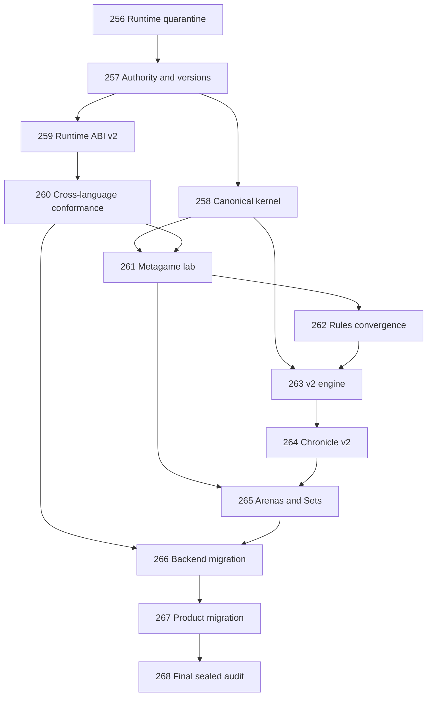

# Draft Roadmap: v2.0 Rules Integrity and Metagame Renewal

**Status:** Proposed; not active
**Starting phase:** 256
**Phases:** 13
**Requirements:** 63/63 mapped exactly once

> This file is input to a future `$gsd-new-milestone` run. It must not be interpreted as the active `.planning/ROADMAP.md` until explicitly approved.

**Proposal:** [PROPOSAL.md](PROPOSAL.md)
**Requirements:** [REQUIREMENTS.md](REQUIREMENTS.md)
**Audit:** [Core rules audit](../../research/v2.0-core-rules-enforcement-runtime-and-metagame-audit.md)

## Dependency shape

## Wave 1 — Restore trustworthy evidence

### Phase 256 — Counted Runtime Quarantine and Evidence Triage

**Goal:** Stop creating suspect counted evidence and establish an auditable fail-closed posture before longer v2 work begins.

**Requirements:** SAFE-01–SAFE-04
**Depends on:** v1.36
**Audit basis:** [F-15 counted containment](../../research/v2.0-core-rules-enforcement-runtime-and-metagame-audit.md#f-15--current-counted-typescript-containment-should-fail-closed-pending-proof)

**Success criteria:**

1. No counted job can select a runtime whose current containment/conformance evidence is absent, stale, mismatched, or downgraded.
2. Unsafe lanes remain available only in explicitly labeled non-counted contexts permitted by policy.
3. Potentially affected evidence can be inventoried, classified, invalidated, and standings-recomputed without rewriting historical records.
4. Public and operator surfaces pass the existing privacy/redaction gates and contain no sensitive reproduction detail.

**Release note:** This phase should be deployable as a v1.36.1-style safety checkpoint rather than waiting for v2.0 completion.

### Phase 257 — v2 Authority, Version, and Compatibility Contract

**Goal:** Define one owner for each rules/evidence decision and persist the version tuple before any v2 artifact is produced.

**Requirements:** AUTH-01–AUTH-05
**Depends on:** 256
**Audit basis:** [F-01 duplicate loops](../../research/v2.0-core-rules-enforcement-runtime-and-metagame-audit.md#f-01--two-full-match-loops-can-drift), [F-10 stale entry point](../../research/v2.0-core-rules-enforcement-runtime-and-metagame-audit.md#f-10--a-stale-contiguous-activation-entry-point-remains-public), [F-20 arena authority](../../research/v2.0-core-rules-enforcement-runtime-and-metagame-audit.md#f-20--current-arenas-and-seeds-provide-nominal-rather-than-real-scenario-diversity)

**Success criteria:**

1. A decision register identifies the canonical owner for rules, transitions, events, runtime classification, Chronicle validation, arena definitions, and counted scheduling.
2. Every new v2 Match/evidence record carries a validated rules/engine/Chronicle/ABI/arena/Set tuple.
3. The compatibility matrix rejects unsupported or mixed tuples before execution.
4. Boundary monitors fail on duplicate Match loops, adapter-owned gameplay classification, UI-owned rules, and duplicate arena definitions.
5. v1.4 specifications and evidence are declared immutable historical authority.

### Phase 258 — Canonical Transition Kernel and v1.4 Correctness Baseline

**Goal:** Establish one transition driver and repair confirmed current-rules defects without changing valid v1.4 behavior.

**Requirements:** KERN-01–KERN-05
**Depends on:** 257
**Audit basis:** [F-01–F-12](../../research/v2.0-core-rules-enforcement-runtime-and-metagame-audit.md#confirmed-enforcement-and-authority-findings)

**Success criteria:**

1. Engine Match execution and Chronicle recording consume one transition sequence; no second full Phase/Round/Contraction loop remains.
2. Semantic validators reject every persisted impossible arena/final-state reproduction.
3. Last-Soldier cleanup emits the outcome immediately, and Cycle-end Backstab closes the actor’s slot with the correct status reason.
4. Excess-order precedence, same-direction collision, and push history have explicit compatibility decisions plus regression tests.
5. Differential fixtures prove that valid canonical v1.4 Matches retain their state/event outcomes through the refactor.

### Phase 259 — Runtime ABI v2 and Counted Adapter Repair

**Goal:** Define and implement one canonical JSON/failure contract with durable adapter containment and exact artifact identity.

**Requirements:** RABI-01–RABI-06
**Depends on:** 257; implementation can proceed alongside 258
**Audit basis:** [F-02](../../research/v2.0-core-rules-enforcement-runtime-and-metagame-audit.md#f-02--runtime-failure-classification-is-not-language-neutral-end-to-end), [F-03](../../research/v2.0-core-rules-enforcement-runtime-and-metagame-audit.md#f-03--valid-size-deeply-nested-memory-can-throw-during-safe-validation), [F-14](../../research/v2.0-core-rules-enforcement-runtime-and-metagame-audit.md#f-14--python-source-normalization-and-revision-identity-can-disagree), [F-15](../../research/v2.0-core-rules-enforcement-runtime-and-metagame-audit.md#f-15--current-counted-typescript-containment-should-fail-closed-pending-proof)

**Success criteria:**

1. Canonical JSON rejects or normalizes every numeric, Unicode, duplicate-key, depth, node, and byte boundary identically.
2. Success, player violation, and system failure remain distinct from runtime host to engine transition.
3. A system failure produces no board/memory mutation and no player penalty.
4. Equivalent resource budgets have documented and tested semantics across every counted lane.
5. CRLF/original-byte, normalized-byte, artifact, manifest, toolchain, and runtime identities validate consistently.

**Split condition:** If this phase exceeds roughly four independently verifiable plans, split the canonical ABI/normalization contract from adapter containment rather than weakening Phase 260.

### Phase 260 — Executable Cross-Language Conformance and Eligibility Gate

**Goal:** Replace parity-by-declaration with a complete executable TypeScript/Python/Rust/Zig trace and failure proof.

**Requirements:** CONF-01–CONF-04
**Depends on:** 259
**Audit basis:** [F-13 parity weakness](../../research/v2.0-core-rules-enforcement-runtime-and-metagame-audit.md#f-13--the-four-language-gate-declares-much-more-than-it-executes)

**Success criteria:**

1. All four languages run the same positive/negative corpus rather than sharing only gate names.
2. Every case compares canonical state, event, memory, objective, and failure traces.
3. Differential/property/mutation cases cover malformed values, budgets, unavailable runtimes, transport failures, and stale artifacts.
4. Counted eligibility is automatically derived from a current passing conformance artifact hash and becomes ineligible after any relevant drift.

## Wave 2 — Measure and select the smallest better ruleset

### Phase 261 — Metagame Measurement Lab and Sealed Benchmark Corpus

**Goal:** Build trustworthy independent measurement before selecting any rule change.

**Requirements:** META-01–META-05
**Depends on:** 258, 260
**Audit basis:** [F-16–F-22](../../research/v2.0-core-rules-enforcement-runtime-and-metagame-audit.md#game-design-and-metagame-findings)

**Success criteria:**

1. The benchmark contains independent implementations and behaviorally verified doctrine families.
2. Design and sealed-holdout arena pools are distinct, symmetric, schema-valid, and committed before tuning.
3. Paired scenarios give every entrant each side and each initiative state, producing a complete payoff matrix/best-response graph.
4. First-contact, pacing, interaction, draw, runtime, complexity, and anti-dominance thresholds are locked before candidate output is inspected.
5. The staged funnel runs micro-scenarios, 48–96 Match screens, full in-process matrices, and only then sealed/service proof.

### Phase 262 — Minimal v2 Rules Convergence and Standalone Spec Freeze

**Goal:** Select the smallest causally supported bundle and publish one complete rules authority.

**Requirements:** RULE-01–RULE-07
**Depends on:** 261
**Experiment protocol:** [PROPOSAL.md](PROPOSAL.md#rule-experiment-posture)

**Success criteria:**

1. Cycle caps `12/8/6/5/4` are compared under paired current-start/current-MOVE scenarios; cap 6 is the first challenger and cap 4 is not presumed preferable.
2. Inward starts and facing-only MOVE are tested independently, including reserve-turtle and TURN-budget effects.
3. Backstab scan timing is tested separately from attacker-facing geometry under both surviving movement profiles.
4. Every ambiguous collision, push, order, and terminal case has literal prose plus executable examples.
5. One minimal passing profile is frozen; rejected candidates and complexity costs remain recorded.

### Phase 263 — v2 Engine and Canonical Event Implementation

**Goal:** Implement only the selected v2 profile on the canonical kernel.

**Requirements:** ENG-01–ENG-04
**Depends on:** 258, 262

**Success criteria:**

1. No experimental rule flag or alternate resolver bypasses the canonical kernel in production.
2. Every v2 input/intermediate/final state satisfies semantic invariants before evidence is emitted.
3. State, outcome, slot lifecycle, terminal reason, and event subject agree after every transition.
4. Executable-spec, model, property, differential, and mutation suites cover the accepted profile and rejected edge cases.

### Phase 264 — Chronicle v2 Grammar, Reconstruction, and Historical Compatibility

**Goal:** Define Chronicle v2 from the frozen event model and preserve v1.4 without reinterpretation.

**Requirements:** CHRN-01–CHRN-04
**Depends on:** 257, 263
**Audit basis:** [F-08](../../research/v2.0-core-rules-enforcement-runtime-and-metagame-audit.md#f-08--chronicle-grammar-does-not-track-interleaved-slots-independently), [F-09](../../research/v2.0-core-rules-enforcement-runtime-and-metagame-audit.md#f-09--active-v14-chronicles-accept-historical-backstab-boundaries)

**Success criteria:**

1. Grammar tracks each open slot by `activationId` and rejects duplicate/out-of-order Cycle progress.
2. Event boundary literals are strict by Chronicle version.
3. Runtime-service and persistence require complete semantic validation.
4. Replay reconstruction and engine execution produce equal canonical transition/trace hashes.
5. Historical v1.4 evidence remains readable under original semantics and is never relabeled as v2.

## Wave 3 — Make the trusted rules the competitive product

### Phase 265 — Arenas, Mirrored Set Policy, and Independent Strategy Baselines

**Goal:** Make a fair deterministic multi-scenario Set the counted unit.

**Requirements:** SET-01–SET-05
**Depends on:** 261–264
**Audit basis:** [F-19–F-22](../../research/v2.0-core-rules-enforcement-runtime-and-metagame-audit.md#f-19--the-advanced-library-overstates-strategic-independence)

**Success criteria:**

1. Each counted Set spans multiple genuinely distinct symmetry-balanced arenas.
2. Each entrant receives each side and each initial-initiative state; the existing mirror/suffix fairness defect is covered by regression tests.
3. Arena definitions have one production authority shared by persistence, Go, UI, replay, and tests.
4. Strategy Revisions are frozen before scheduling/reveal and remain immutable through the Set.
5. Starter/Advanced/benchmark lineage and behavioral distinctness claims match executable evidence.

### Phase 266 — Service, Persistence, and Counted Eligibility Migration

**Goal:** Move backend contracts and competition evidence atomically to v2 semantics.

**Requirements:** BACK-01–BACK-04
**Depends on:** 260, 263–265

**Success criteria:**

1. Go, runtime-service, workers, persistence, and generated contracts agree on and reject the same incompatible tuples.
2. Counted eligibility binds current engine/ABI/Chronicle/provider/artifact/containment/conformance evidence.
3. Standings and governance recompute from v2 Set semantics while v1.36 evidence remains unchanged.
4. Retry, idempotency, canonical evidence, ownership, privacy, and rollback proof remain green.

### Phase 267 — Workshop, Replay, Strategy, and Documentation Migration

**Goal:** Expose v2 accurately to players without inventing new rule authorities.

**Requirements:** PROD-01–PROD-04
**Depends on:** 264–266

**Success criteria:**

1. SDK/Workshop inputs, Actions, validation, and examples agree in all supported languages.
2. Existing revisions have explicit v1.4-only, revalidated, migrated, or ineligible status.
3. Result/replay surfaces validate and render v1.4 and v2 distinctly.
4. Learn/rules/trust/competition copy derives from canonical contracts and passes drift monitors.

### Phase 268 — Final Trust, Metagame, Security, Privacy, and E2E Audit

**Goal:** Open the sealed evidence, rerun every known failure, and make a fail-closed v2 launch decision.

**Requirements:** PROOF-01–PROOF-06
**Depends on:** 256–267

**Success criteria:**

1. All persisted reproductions and complete semantic/property suites pass.
2. Four languages produce equal canonical traces and failure classes over the full corpus.
3. Every counted lane passes the approved threat model; failures remain exhibition-only.
4. The unopened metagame holdout clears the locked first-contact, pacing, interaction, complexity, and practical anti-dominance gates.
5. Service-backed entry through Set scheduling, execution, standings, result, replay, governance, privacy, recomputation, historical compatibility, and rollback passes end to end.

## Coverage

| Phase | Requirements | Count |
|---:|---|---:|
| 256 | SAFE-01–SAFE-04 | 4 |
| 257 | AUTH-01–AUTH-05 | 5 |
| 258 | KERN-01–KERN-05 | 5 |
| 259 | RABI-01–RABI-06 | 6 |
| 260 | CONF-01–CONF-04 | 4 |
| 261 | META-01–META-05 | 5 |
| 262 | RULE-01–RULE-07 | 7 |
| 263 | ENG-01–ENG-04 | 4 |
| 264 | CHRN-01–CHRN-04 | 4 |
| 265 | SET-01–SET-05 | 5 |
| 266 | BACK-01–BACK-04 | 4 |
| 267 | PROD-01–PROD-04 | 4 |
| 268 | PROOF-01–PROOF-06 | 6 |
| **Total** | **All proposed requirements** | **63** |

**Unmapped:** 0
**Multiply mapped:** 0
