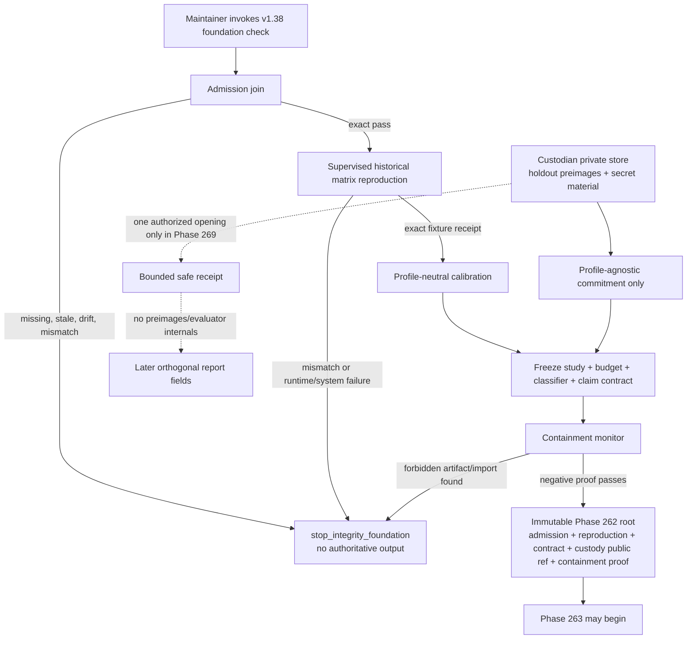

# Phase 262: Foundation Admission, Measurement, Custody, and Containment Contract - Research

**Researched:** 2026-07-28
**Domain:** Fail-closed predecessor admission, preregistered empirical-game measurement, sealed-holdout custody, and lab/production containment
**Confidence:** HIGH

<user_constraints>
## User Constraints (from CONTEXT.md)

### Locked Decisions

### Milestone-wide integrity charter
- **D-01:** Evidence is immutable and content-addressed. There is no mutable `latest`; a changed input, policy, implementation, or result creates a new branch with a new root.
- **D-02:** Missing, stale, incompatible, contaminated, incomplete, mismatched, or non-reproducible evidence fails closed. Process/integrity failure is distinct from a process-valid empirical failure and blocks authoritative progress.
- **D-03:** The exact selected canonical `MATCH_KERNEL` remains the only transition authority, and hostile Strategy source remains behind the supervised runtime-service / Runtime Broker boundary. No copied rules, alternate scheduler, or Strategy execution in the coordinator, web, API, or Go is permitted.
- **D-04:** Lab evidence remains private and unreachable from production registration, persistence, scheduling, Chronicle, replay, standings, and public/default surfaces. Only exact eligible pre-formation current-league source hashes may later enter ordinary certification.
- **D-05:** Every attempt, retry, rejection, invalid output, duplicate, failure, system failure, and unused allocation remains charged and visible in its proper evidence ledger; accepted evidence cannot omit inconvenient work.
- **D-06:** Cycle-cap, MOVE/reversal, Backstab geometry/timing, scan timing, arena, runtime, product/public, and combined-rule changes remain unavailable in v1.38.

### Exact predecessor admission
- **D-07:** Authoritative v1.38 work begins only after a machine-checked join resolves the v1.37 audit, exact archive commit, annotated `v1.37` tag, independent post-tag result, and exact selected semantic/runtime authority tuple. Copied labels are not authority.
- **D-08:** The immutable v1.37 archive commit remains the release authority. Later non-semantic corrections are recorded as separate lineage and may inform current correctness checks, but they do not move, recreate, or silently reinterpret the tag or archived evidence.
- **D-09:** Any failed join, stale certificate, incompatible identity, semantic drift, or unexplained reproduction mismatch emits an explicit stop disposition back to the integrity foundation. Phase 262 must not normalize or repair the predecessor inside v1.38.
- **D-10:** Reproduce the persisted current-rules matrix's declared shape and expected results through the selected canonical kernel and supervised execution path. The audit script's `new Function` loader is historical reproduction material, not an execution mechanism to reuse. Starter and Advanced Strategies remain smoke, regression, and throughput fixtures only.

### Frozen measurement and budget contract
- **D-11:** Before inspecting candidate output, freeze one immutable contract for the primary estimand—separately adapted formation-specific metagames under the fixed factory—and the bracket/current, inward/current, and bracket/inward contrasts. Fixed-policy transfer is explicitly secondary screening.
- **D-12:** The contract fixes complete cells, scoring, draw value, both sides, both entrant-level initiative states, semantically distinct design arenas, all splits and opponent fields, matched root-seed blocks, stopping and response admission, finalist eligibility/cardinality, portfolio selection, robust-pure selection, and permitted claims.
- **D-13:** Freeze a multi-resource opportunity vector rather than a single fungible compute scalar: attempted candidates, accepted response slots and unfilled-slot disposition, response rounds, search/teacher/distillation work, Matches, model attempts/tokens, human effort/submissions, replay review, cache policy, retries, hardware class, runtime, source, objective, memory, and output limits.
- **D-14:** Contained profile-neutral calibration spikes may refine structural work units, denominators, retry/burn rules, and starting numeric gates before search. Direct Strategy work must be distinguished from provider, orchestration, and infrastructure overhead. Candidate outcomes may not influence calibration.
- **D-15:** The activation prompt's 64 KB hard source cap, preferred under-48 KB target, below-5 ms p99 starting target, population/core/finalist counts, response thresholds, probe threshold, red-team threshold, and Advanced-library regression threshold are calibration inputs. Any replacement value and its exact denominator must be justified and frozen before candidate output is inspected.
- **D-16:** Zero accepted runtime violations, system failures, legal-information violations, private-data leaks, missing cells, duplicate/conflicting results, or unproved identity joins is a hard evidence condition. System-failed work remains charged but can never be converted into gameplay or an accepted cell.
- **D-17:** Metric code, canonicalization, normalization, denominators, replication treatment, materiality thresholds, hard versus compensating gates, classifier fixtures, response/finalist rules, and report language are hashed with the contract. A composite result cannot override a mandatory integrity or rejection gate.
- **D-18:** Reports maintain separate fields for `process_status`, current-rules outcome, formation rejection/pass, and holdout contamination. A valid empirical failure is publishable evidence; threshold softening, selective failure omission, or stronger-than-oracle-relative claims are not.

### Holdout custody and pre-formation containment
- **D-19:** A separately permissioned custodian and private store control the holdout preimages and commitment material. The iterative experiment coordinator receives only a profile-agnostic commitment before opening and one bounded safe receipt after the authorized batch.
- **D-20:** Holdout lineage must prove that source data, training data, prompts, caches, opponent construction, and schedule construction contain no profile-conditioned or current-trained input. Custody records the named role, authorized opening actor, access/query ledger, storage identity, safe projection, contamination response, retention, and retirement.
- **D-21:** Premature access, unauthorized query, commitment mismatch, uncertain evaluator state, or disclosure outside the frozen safe projection is contamination, not a diagnostic opportunity. It follows the precommitted invalidation/reporting path and cannot be repaired with a replacement or second holdout.
- **D-22:** Precommit the literal current-edge, full-inward, and edge-anchored-bracket coordinates, unchanged inward facings, equal-compute dimensions, telemetry, causal classifiers, and hard rejection logic now. Only profile-agnostic schemas, metric code, and synthetic positive/negative/mirrored/obfuscated fixtures may exist before the valid Phase 266 current-league freeze.

### the agent's Discretion
- Exact schema, module, command, storage, and typed-reason names are left to research and planning within the locked evidence and privacy boundaries.
- Exact budget values, materiality thresholds, classifier cutoffs, commitment primitive, encrypted-storage mechanism, and retention sampling are chosen only after the required contained Phase 262 spikes, then frozen before candidate output is inspected.
- A managed signing identity may be used if one already exists; Phase 262 must not create an ad hoc signing trust system to simulate custody.

### Deferred Ideas (OUT OF SCOPE)
- Planner and deterministic runner implementation belongs to Phase 263.
- Candidate factory, independent oracles, and quarantined intake belong to Phase 264.
- League execution and current-league freeze belong to Phases 265–266.
- Executable formation materialization, equal retraining, sealed opening, decision, certification, and release closure belong to Phases 267–270.
- Cap, MOVE, Backstab, scan-timing, arena, runtime, product, and combined-rule experiments require separately approved later work.
</user_constraints>

## Summary

Phase 262 should be planned as a sequence of immutable gates, not as the first implementation slice of the Strategy factory. The repository already contains nearly every low-level primitive needed: exact semantic-authority resolution, canonical JSON admission, domain-separated SHA-256 identities, the selected `MATCH_KERNEL`, the runtime-service three-way result boundary, canonical arena geometry identity, four-condition Set scheduling, release-tag verification, append-only restricted evidence storage, safe receipt projection, and mutation-heavy fail-closed tests. [VERIFIED: codebase inspection of `packages/spec`, `packages/engine`, `apps/runtime-service`, and `scripts/lib`]

The new work is composition and preregistration. Build one admission command that joins the immutable v1.37 archive/tag/post-tag identities to the exact current semantic/runtime tuple; one safe reproduction of the historical 540-Match matrix through the supervised current runtime path; one profile-neutral pre-search contract whose code, schemas, fixtures, budgets, thresholds, claims, and custody policy are all content-addressed; and one containment monitor that proves forbidden executable formation and candidate artifacts are absent. [VERIFIED: `.planning/ROADMAP.md`, Phase 262 success criteria; `262-CONTEXT.md` D-07 through D-22]

The plan must include a calibration wave before the freeze wave. Calibration may measure throughput, structural work units, retry/burn accounting, fixture classifier behavior, storage operations, and safe-receipt bounds using only historical Starter/Advanced fixtures and synthetic profile-agnostic data. It may not inspect or produce candidate outcomes. After the contract root is frozen, every downstream phase must bind that exact root; changes create a new branch and cannot overwrite a mutable `latest`. [VERIFIED: `262-CONTEXT.md` D-01, D-14, D-17]

**Primary recommendation:** Implement Phase 262 as five ordered deliverables—admission join, safe matrix reproduction, contained calibration, immutable study/custody contract, and adversarial containment proof—with a hard stop between each deliverable and no executable formation or candidate namespace.

## Architectural Responsibility Map

| Capability | Primary Tier | Secondary Tier | Rationale |
|---|---|---|---|
| v1.37 admission and exact identity join | Offline release/research tooling | Canonical spec authority | Release tooling reads Git/archive evidence; `@cowards/spec` resolves the exact semantic tuple. [VERIFIED: `scripts/check-v1-37-release-tag.ts`; `packages/spec/src/current-semantic-authority-generated.ts`] |
| Historical matrix reproduction | Runtime Service | Canonical engine | Hostile Advanced source must execute behind supervision; all transitions must flow through the selected kernel. [VERIFIED: AGENTS.md; `apps/runtime-service/src/execute-match.ts`; `packages/engine/src/kernel/driver.ts`] |
| Study, budget, metric, and claim contract | Offline research tooling | Canonical spec encoding | This is private control-plane metadata, not game logic or a product API. [VERIFIED: Phase 262 boundary and D-11 through D-18] |
| Holdout preimages and access ledger | Private external storage / custodian | Offline research tooling safe projection | The coordinator may receive only a commitment and bounded receipt, never the preimages or evaluator internals. [VERIFIED: D-19 through D-21; SEAL-01] |
| Classifier schemas and synthetic fixtures | Offline research tooling | Canonical Chronicle-derived projections later | Only profile-neutral code and synthetic fixtures are permitted before Phase 266. [VERIFIED: D-22; MEAS-10] |
| Production unreachability | Build/import boundary monitors | All production packages/apps | Deny dependencies and artifact flows into registration, persistence, scheduling, Chronicle, replay, standings, and public surfaces. [VERIFIED: D-04; roadmap Binding Delivery Rules] |

<phase_requirements>
## Phase Requirements

| ID | Description | Research Support |
|---|---|---|
| ADMIT-01 | Begin only after v1.37 audit/archive/tag/post-tag pass. | Exact join inputs, observed tag/archive identities, and fail-closed admission disposition are specified below. |
| ADMIT-02 | Bind exact rules, engine, runtime ABI, Chronicle, arena, Set policy, canonical JSON, provider, runtime, and conformance identities. | Reuse `CURRENT_SEMANTIC_AUTHORITY_GENERATED` plus the v1.37 foundation artifact; never copy labels. |
| ADMIT-03 | Reproduce the historical current-rules matrix; Starter/Advanced remain fixtures only. | Safe supervised reproduction seam and exact historical shape are identified below. |
| ADMIT-04 | Stop on missing/stale/incompatible/drifting predecessor authority. | Use a discriminated stop disposition with no repair/override path. |
| MEAS-01 | Freeze primary/secondary estimands, conditions, splits, opponents, and complete cells. | Recommended study-contract schema and complete-cell identity are specified below. |
| MEAS-02 | Freeze matched seeds and multi-resource opportunity vector. | Structural work-unit ledger and burn rules are specified below. |
| MEAS-03 | Freeze metric code, thresholds, stopping, selection, and permitted claims. | Hash code/schema/fixtures/report-language together; selection and retry rules are non-mutable. |
| MEAS-04 | Zero integrity violations in accepted evidence. | Separate accepted-cell store from charged attempt ledger; system failures cannot be promoted. |
| MEAS-05 | Calibrate source/runtime feasibility targets. | Use the canonical 64 KB limit, preferred 48 KB target, and an identified p99 benchmark contract. |
| MEAS-06 | Freeze population/core/finalist structural targets. | Preserve starting values unless the profile-neutral calibration receipt justifies replacements. |
| MEAS-07 | Freeze response, probe, and red-team thresholds. | Encode threshold, denominator, untouched field identity, and consecutive-round semantics. |
| MEAS-08 | Advanced results are regression-only; claims are oracle-relative. | Mechanically label fixture class and claim-lint all reports. |
| MEAS-09 | Separate process/current/formation/contamination fields. | Recommended orthogonal report state machine is specified below. |
| MEAS-10 | Precommit literal profiles, equal compute, custody, telemetry, rejection, and non-authorization without materialization. | Protocol-only profile records, profile-neutral classifiers, custody packet, and negative monitor are specified below. |
| SEAL-01 | Separately permissioned custodian controls preimages, commitment, opening, storage, ledger, receipt, contamination, retirement. | Reuse the restricted-store mechanics; add custodian/opening-specific closed schemas and secret-keyed commitment. |
| DECI-02 | Operationalize opening and causal classifiers with exact denominators and synthetic fixtures. | Classifier definitions, calibration procedure, fixture matrix, and non-compensating logic are specified below. |
</phase_requirements>

## Project Constraints (from AGENTS.md)

- Keep engine logic pure, deterministic, serializable, side-effect free, and free of `Math.random`, `Date.now`, system time, filesystem, network, or database access. Phase 262 tooling may perform release/storage I/O, but it must not move any of that I/O into engine logic. [VERIFIED: AGENTS.md]
- Do not place game rules in React or execute Strategy source in the web/API process. [VERIFIED: AGENTS.md]
- Do not use Node `vm` as a security boundary; the historical matrix's `new Function` loader is equally unsuitable for authoritative reuse. [VERIFIED: AGENTS.md; historical matrix source]
- Treat Strategy source as hostile and schema-validate every runtime boundary. [VERIFIED: AGENTS.md]
- Preserve canonical terminology and immutable Strategy Revisions. [VERIFIED: AGENTS.md]
- Public replay/default output must exclude Strategy source, StrategyMemory, SoldierMemory, and objectives. Phase 262 additionally excludes holdout preimages, secret commitment material, evaluator internals, and raw access/query data. [VERIFIED: AGENTS.md; SEAL-01; D-19]
- Engine rules require focused unit and invariant/property tests; runtime tests must cover invalid outputs, timeouts, forbidden capabilities, limits, and schema validation. [VERIFIED: AGENTS.md]
- Keep planning docs committed when updated. [VERIFIED: AGENTS.md]

## Verified Current Baseline

| Item | Verified value on 2026-07-28 | Planning consequence |
|---|---|---|
| v1.37 annotated tag object | `44d7bb03c175ec3ee2557193c6b190aa44001244` | Bind the tag object, not only the tag name. [VERIFIED: `git rev-parse refs/tags/v1.37`] |
| v1.37 archive commit | `e704590df599b49d84745b0e828d5ab0f1d335ad` | This immutable commit remains release authority. [VERIFIED: `git rev-parse refs/tags/v1.37^{}`] |
| post-tag checker | `{"mode":"post-tag","proof08":true}` for the exact archive commit | Admission should invoke the read-only checker and bind its source hash and result. [VERIFIED: live `pnpm exec tsx scripts/check-v1-37-release-tag.ts --post-tag-archive ...`] |
| post-tag non-semantic correction | commit `58b50f57b349311c03e814f2efaeb138f8627c38` | Record as later lineage; never reinterpret or move the release tag. [VERIFIED: Git log and correction artifact] |
| selected authority key | `runtime-v1.19` | Reject aliases, older selections, or copied labels. [VERIFIED: `CURRENT_SEMANTIC_AUTHORITY_GENERATED`] |
| selected tuple ID | `sha256:37c9a07425d454c74859112debcc3ef362d43e80d5767560d9bde28a3c8d5e73` | Every Phase 262 root must bind this exact current selection unless the join stops for drift. [VERIFIED: generated authority and v1.37 foundation artifact] |
| selected versions | rules `cowards-rules-v1.4`; engine `engine-kernel-v1.37-candidate-1`; runtime ABI `strategy-runtime-abi-v1.19`; Chronicle `chronicle-recorder-current-events-v1.37-candidate-1`; arena catalog `canonical-arena-catalog-v1.37`; Set policy `canonical-set-policy-v1.37-four-condition-v1`; canonical JSON `canonical-json-v1.1`; runtime service `runtime-execution-service-v1.18` | Resolve values through code/artifacts and compare exact identities. [VERIFIED: v1.37 foundation artifact] |
| canonical Set policy | Four conditions cover each entrant on each side and each entrant-level initiative state; partial matrices and system failures do not count. | Reuse the policy identity for complete cells; do not infer initiative from seed parity. [VERIFIED: v1.37 foundation artifact and `set-condition-policy-v1-37.ts`] |
| active semantic arena geometries | Smoke and Standard Cross have distinct semantic geometry hashes. | Experimental design arena diversity must deduplicate by semantic geometry hash, never display name. [VERIFIED: v1.37 foundation artifact and `arena-catalog-v1-37.ts`] |
| working tree | Clean at research time; HEAD `53b6928bb650e751d588fc52c61ad6f1fafcc565` | No pre-existing Phase 262 implementation artifacts were found. [VERIFIED: Git status and rev-parse] |

The concrete hashes above are research-time observations, not values to paste permanently into the implementation. The admission generator should resolve them and write them into an immutable receipt, while tests may pin the expected released v1.37 identities. [VERIFIED: D-07 forbids copied labels as authority]

## Standard Stack

### Core

| Library / subsystem | Version | Purpose | Why Standard |
|---|---|---|---|
| Node.js built-ins (`node:crypto`, `node:fs`, `node:path`, `node:child_process`) | Node `v24.15.0` installed | Content identities, HMAC commitment, private-store mechanics, exact Git/checker invocation | Existing scripts already use these built-ins; no dependency is needed. [VERIFIED: environment and codebase] |
| `@cowards/spec` | workspace current, selected tuple `runtime-v1.19` | Canonical JSON, identity domains, tuple resolution, arena and Set policy | It is the existing authority owner. [VERIFIED: `integrity-authority.ts`] |
| `@cowards/engine` | workspace current, `engine-kernel-v1.37-candidate-1` | Exact `MATCH_KERNEL` transition authority | `MATCH_KERNEL` exposes current v1.19 creation/run seams. [VERIFIED: `driver.ts`] |
| `@cowards/runtime-service` | workspace current, service contract `v1.18` | Supervised hostile-source execution and success/player/system classification | It already routes v1.19 current Matches through the canonical kernel and runtime providers. [VERIFIED: `execute-match.ts`] |
| Vitest | `4.1.6` declared | Unit, mutation, invariant, schema, and boundary tests | Existing package and script tests use Vitest. [VERIFIED: root `package.json`] |
| TypeScript / `tsx` | TypeScript `6.0.3`, `tsx` `4.22.0` declared | Typed generators/checkers and CLI commands | Matches every recent v1.37 evidence generator. [VERIFIED: root `package.json`] |

### Supporting

| Library / subsystem | Version | Purpose | When to Use |
|---|---|---|---|
| Git | `2.50.1` installed | Annotated-tag, object, archive, ancestry, and clean-tree identity | Admission and immutable lineage checks. [VERIFIED: environment] |
| Existing restricted evidence store | v1.37 internal implementation | Exclusive content-addressed writes, `0700` directories, `0600` files, no-symlink reads, append-only access events, retention/deletion proof | Adapt its mechanics for a new v1.38 custody schema; do not reuse its v1.37 closed evidence classes unchanged. [VERIFIED: `scripts/lib/v1-37-restricted-evidence-store.ts`] |
| Existing Ed25519 receipt pattern | runtime semantic receipt v1.18 | Verify a managed signer when one already exists | Use only if an existing managed signing identity is explicitly available to the custodian. [VERIFIED: `runtime-semantic-receipt-v1-18.ts`; D-19 discretion] |
| OpenSSL | `3.6.2` installed | Independent digest/crypto smoke verification | Optional cross-check only; canonical implementation remains Node built-ins. [VERIFIED: environment] |
| Docker | `29.4.0` installed | Existing supervised runtime/container paths | Use only if the selected current runtime path requires it during matrix reproduction; absence must stop rather than fall back to unsafe execution. [VERIFIED: environment and runtime architecture] |

### Alternatives Considered

| Instead of | Could Use | Tradeoff |
|---|---|---|
| Built-in `node:crypto` | New hashing/commitment npm package | Adds supply-chain and canonicalization risk with no needed capability. Use built-ins. |
| Secret-keyed HMAC commitment | Bare SHA-256 of low-entropy holdout manifest | A bare digest may reveal an enumerable preimage; use a custodian-only secret or secret salt and commit the algorithm/key identifier without exposing the secret. [CITED: https://nodejs.org/api/crypto.html] |
| Existing managed Ed25519 signer | New Phase 262 keypair/trust root | Creating an ad hoc trust system is explicitly forbidden. If no managed signer exists, use the frozen HMAC commitment and custody/access proof without pretending it is a signature. [VERIFIED: D-19 discretion] |
| Script/library modules | Product API, database, or React surface | Product surfaces would violate containment and increase reachability. Keep Phase 262 private and offline. [VERIFIED: D-04] |

**Installation:** No external packages should be installed for Phase 262.

## Package Legitimacy Audit

Not applicable. The recommended implementation installs no external package and uses only existing workspace dependencies and Node built-ins. [VERIFIED: Standard Stack analysis]

## Architecture Patterns

### System Architecture Diagram



### Recommended Project Structure

```text
scripts/
├── evaluate-v1-38-foundation-contract.ts       # one write/check orchestration command
├── evaluate-v1-38-foundation-contract.test.ts
└── lib/
    ├── v1-38-foundation-admission.ts           # exact v1.37 join + typed stops
    ├── v1-38-current-matrix-reproduction.ts    # supervised fixture runner/reducer
    ├── v1-38-study-contract.ts                 # exact schemas, canonical renderer, root
    ├── v1-38-measurement.ts                    # profile-neutral metrics/classifiers
    ├── v1-38-custody.ts                        # commitment, access/open/retire state machine
    └── v1-38-containment.ts                    # allowlist/import/artifact absence proof
.planning/artifacts/
├── v1.38-foundation-admission.json             # public-safe exact join receipt
├── v1.38-current-matrix-reproduction.json      # regression-only reproduction receipt
├── v1.38-pre-search-contract.json               # immutable protocol, budgets, gates, claims
├── v1.38-custody-public-reference.json          # commitment/store/key IDs; no secrets/preimages
├── v1.38-pre-formation-containment.json         # negative proof and monitor identity
└── v1.38-foundation-contract-root.json          # joins the preceding artifacts
```

Do not create a `formation/`, `profiles/`, `candidates/`, `prompts/`, `cache/`, `traces/`, `replays/`, or `results/` artifact namespace in this phase. The literal three-profile protocol belongs inside the pre-search contract as `protocol_only` data and must have no conversion function to `GameState`. [VERIFIED: D-22 and Phase Boundary]

### Component Responsibilities

| Component | Owns | Must not own |
|---|---|---|
| Foundation admission | Exact Git/archive/tag/post-tag/semantic/runtime join and stop reasons | Repairs, normalizations, overrides, current gameplay |
| Matrix reproduction | Historical inventory, supervised requests, exact reduction, fixture-only labels | `new Function`, direct Strategy imports, balance claims |
| Study contract | Estimands, cells, splits, budgets, gates, metrics, claims, protocol text | Candidate output, finalist hashes, holdout preimages |
| Measurement module | Pure functions over bounded profile-neutral projections and synthetic fixtures | Engine transitions, filesystem/network/time, alternate rules |
| Custody module | Commitment verification, access/open/retire state transition, safe projection | Private preimages in repo, diagnostic second query, ad hoc signing |
| Containment monitor | Dependency and artifact allowlist, negative scans, seeded bypass detection | Product behavior or future formation materialization |
| Root generator | Canonical join of all passed Phase 262 receipts | Mutable aliases or implicit filesystem discovery |

### Pattern 1: Exact-keys discriminated admission result

**What:** Parse every input into an exact schema, resolve identities from authority sources, and return either a passed immutable receipt or a closed typed stop disposition.
**When to use:** Every prerequisite, matrix, custody, or containment gate.
**Why:** v1.37 already uses exact-key validators and rejects boolean waiver/override shapes. [VERIFIED: `check-v1-37-audit-reproduction.ts` and tests]

Recommended result shape:

```typescript
type FoundationAdmissionResult =
  | Readonly<{
      status: "passed_exact"
      admissionRoot: `sha256:${string}`
      archiveCommit: string
      tagObject: string
      semanticTupleId: string
      runtimeAuthorityRoot: string
      bindings: readonly ContentBinding[]
    }>
  | Readonly<{
      status: "stopped_integrity_foundation"
      reason:
        | "AUDIT_MISSING"
        | "ARCHIVE_MISMATCH"
        | "TAG_NOT_ANNOTATED"
        | "POST_TAG_CHECK_FAILED"
        | "SEMANTIC_TUPLE_DRIFT"
        | "RUNTIME_AUTHORITY_STALE"
        | "MATRIX_REPRODUCTION_MISMATCH"
      repairAuthorized: false
    }>
```

The stopped variant must not contain an `override`, `waiver`, `acceptAnyway`, or repair callback. Mutation tests should add each forbidden field and require rejection. [VERIFIED: v1.37 reproduction tests]

### Pattern 2: Content-addressed branch root

**What:** Canonically encode a closed manifest, hash it under a new v1.38 domain tag, and publish only by exclusive create.
**When to use:** Admission, calibration, contract, custody public reference, containment proof, and the aggregate root.
**Why:** Existing canonical JSON rejects malformed/noncanonical material and existing stores already use exclusive `wx` publication. [VERIFIED: `canonical-json.ts`; restricted evidence store]

Every root should bind:

- schema version and identity domain;
- generator/checker source hash;
- exact input path plus content digest;
- exact upstream root(s);
- tool/runtime/platform identity where behavior can vary;
- status and typed reason;
- exact output inventory and digests, with a non-circular self rule: an aggregate artifact binds every authorized output except its own path/digest/root field, hashes a canonical component frame that excludes those self fields, and separately validates its closed-schema derived bytes;
- no mutable timestamp as the semantic identity of reproducible content.

Operational timestamps may appear in access ledgers, but deterministic study identities must not depend on wall clock. [VERIFIED: engine purity boundary and existing evidence patterns]

### Pattern 3: Two-ledger accounting

**What:** Maintain an append-only opportunity/attempt ledger separately from the accepted-cell matrix.
**When to use:** All later candidate, response, Match, model, human, retry, and cache work; Phase 262 freezes the schema now.
**Why:** A system failure is charged work but is not a gameplay result or accepted cell. [VERIFIED: MEAS-02, MEAS-04, D-05]

The attempt ledger needs a record for every allocated unit with:

- stable `allocation_id` and preassigned branch/root-seed block;
- resource vector allocated, attempted, consumed, and unused;
- disposition: accepted, rejected, invalid, duplicate, player violation, system failure, retry, unfilled, or unused;
- parent/retry identity and burn decision;
- result reference only when process-valid;
- no deletion or replacement of the original attempt.

The accepted-cell matrix references attempt IDs but admits only exact process-valid gameplay results. A duplicate task identity with identical bytes is a recorded duplicate; a duplicate identity with conflicting bytes is an integrity stop. [VERIFIED: D-05, D-16]

### Pattern 4: Custodian command/query separation

**What:** Expose distinct commands for `commit`, `authorize-open`, `open-once`, `project-safe-receipt`, `verify`, `mark-contaminated`, and `retire`; the coordinator gets no generic read/query API.
**When to use:** Holdout custody.
**Why:** A generic query method would make bounded one-shot access unenforceable. [VERIFIED: D-19 through D-21]

The access state machine should be monotone:

```text
prepared -> committed -> authorized -> opened_once -> projected -> retired
                    \-> contaminated ----------------------^
```

No transition leaves `contaminated`, and no transition returns to `committed` after opening. A failed safe projection after opening contaminates the run; it does not authorize a diagnostic query or substitute holdout. [VERIFIED: D-21]

### Pattern 5: Protocol-only profile records

**What:** Store the literal coordinates and unchanged inward facings in the study contract with an explicit `materialization: "forbidden_before_phase_267"` marker and no executable adapter.
**When to use:** MEAS-10 precommitment.
**Why:** Textual precommitment is required now; executable state is forbidden until after the Phase 266 freeze. [VERIFIED: D-22]

The contract must state exactly:

- current edge: top `y=0`, bottom `y=11`, `x=2..9`;
- full inward: top `y=1`, bottom `y=10`, `x=2..9`;
- bracket: top rear wings `(2,0),(3,0),(8,0),(9,0)`, top forward center `(4,1)..(7,1)`, bottom forward center `(4,10)..(7,10)`, bottom rear wings `(2,11),(3,11),(8,11),(9,11)`;
- every Soldier retains its current inward facing;
- every other rule, arena, runtime, and public/product behavior is unchanged.

[VERIFIED: activation prompt Stage 5; MEAS-10]

### Anti-Patterns to Avoid

- **Copying release labels into the new root:** Resolve archive, tag object, tuple, runtime authority, and source bytes; labels alone are not authority.
- **Calling the historical matrix script authoritative:** It uses `new Function`, legacy `runMatch`, seed parity, and display arena inventory. Preserve its declared shape/results but replace execution with the supervised selected path.
- **Treating a four-condition Set as four semantically distinct arenas:** Side/initiative conditions and arena geometry are separate dimensions.
- **One scalar “compute budget”:** It hides substitution between model tokens, candidates, Matches, human effort, retries, and cache hits.
- **Retry until success:** Retry consumes the frozen allocation; it never erases the first attempt or grants free work.
- **Signing with a fixture/ephemeral key:** A fixture signature does not establish custody.
- **A generic holdout read API:** One bounded open and one safe projection need closed commands.
- **Putting holdout preimages or secrets in Git:** Only a safe commitment/reference belongs in the repository.
- **Using composite scores to compensate for hard violations:** Runtime, integrity, leakage, contamination, and rejection classifiers are non-compensating.
- **Defining classifier thresholds after candidate or holdout results:** Calibration must be synthetic/profile-neutral and frozen first.

## Frozen Measurement Contract

### Estimands and contrasts

The contract should encode the following hierarchy:

1. **Primary estimand:** the difference between separately adapted, fixed-factory metagames for the three initial-state profiles under equal opportunity vectors.
2. **Primary contrasts:** bracket/current, inward/current, and bracket/inward, each with sign convention and exact paired-cell denominator.
3. **Secondary screening:** fixed-policy transfer across profiles, labeled non-causal and ineligible to decide pass/reject.
4. **Regression-only:** Starter/Advanced outcomes, including the above-70% Advanced threshold.

[VERIFIED: MEAS-01, MEAS-08, D-11]

Each accepted cell identity should be a canonical tuple of:

```text
study_root
branch/profile protocol ID
split ID
opponent-field ID
entrant A source hash
entrant B source hash
semantic arena geometry hash
Set condition ID
matched root-seed block
replicate ordinal
runtime authority root
metric implementation root
```

The full grid must be enumerated before execution. Completion is equality between the predeclared cell-ID set and the accepted-cell ID set; counts alone are insufficient. [VERIFIED: MEAS-01, MEAS-04]

### Structural opportunity vector

Freeze independent units and never convert unused units across dimensions:

| Dimension | Structural unit | Required accounting |
|---|---|---|
| Candidate opportunity | One preassigned candidate attempt | Accepted/rejected/invalid/duplicate/failure/unfilled/unused |
| Response capacity | One accepted-response slot plus its fixed attempt ceiling | Filled source hash or frozen unfilled disposition |
| Response rounds | One declared round against a frozen mixture | Mixture root, untouched field root, admission decision |
| Structured search | One node expansion/evaluation | Allocated/used/burned; deterministic node definition |
| Teacher work | One teacher state/action evaluation | Separate from student/distillation work |
| Distillation | One labeled example processed or one frozen optimization step | Dataset root and deterministic order |
| Matches | One pre-enumerated Match/Set cell | Attempt and accepted-cell separation |
| Model work | One provider attempt and tokens in/out | Provider/model/prompt root; failure remains charged |
| Human work | One submission plus declared review minutes/round | Named channel; failed/rejected work retained |
| Replay review | One preselected replay reviewed under one rubric | Selection rule and reviewer receipt |
| Cache | One exact-key lookup and hit/miss/use disposition | Cache hits do not create extra candidate opportunity |
| Retry | One child of a failed attempt | Burns the parent allocation or a predeclared retry unit |
| Hardware/runtime | One identified benchmark class and lane | CPU/OS/runtime/toolchain and concurrency |
| Artifact limits | Source, objective, memories, output | Exact bytes and canonical encoding profile |

This is a recommended schema derived directly from MEAS-02; exact numeric ceilings are calibration outputs, not research-time guesses.

### Calibration wave

Plan these contained spikes before freezing numeric values:

1. **Historical supervised-matrix throughput:** Execute only persisted Advanced fixtures through the exact selected runtime path; record service and direct-kernel wall/CPU distributions separately. Do not use outcomes to tune any Strategy or threshold.
2. **Structural unit dry run:** Pre-enumerate synthetic task graphs and prove candidate/response/Match/model/human/retry/cache accounting closes exactly.
3. **Runtime benchmark definition:** Fix source fixture, input corpus, warmup, sample count, concurrency, hardware/OS/runtime/toolchain identity, statistic implementation, and denominator for the under-5 ms p99 starting target.
4. **Classifier fixture calibration:** Use synthetic positive, negative, boundary, mirrored, opaque-ID-renamed, Soldier-order-permuted, and obfuscated fixtures. No real profile Match output.
5. **Custody drill:** Use synthetic non-holdout preimages to exercise commit, unauthorized read, one-open, safe projection, commitment mismatch, contamination, retention, and retirement.
6. **Retention/storage sizing:** Measure synthetic object and ledger volume; choose full-versus-compact retention and sampling before opening any real holdout.

[VERIFIED: D-14, Phase 262 research flag]

Every replacement of a starting value must include: old value, new value, exact denominator, calibration input roots, calibration code root, reason, approver, and proof that candidate output was unavailable. [VERIFIED: D-15]

### Starting values that must survive into calibration

| Gate | Starting value | Freeze detail |
|---|---:|---|
| Hard source cap | 64 KB | Canonical UTF-8 source bytes; existing `STRATEGY_SOURCE_BYTES = 65536`. [VERIFIED: `packages/spec/src/constants.ts`] |
| Preferred source target | under 48 KB | Non-hard feasibility target; exact treatment for equality must be stated. [VERIFIED: activation prompt] |
| Direct runtime target | below 5 ms p99 | One fixed benchmark with exact sample denominator and hardware identity. [VERIFIED: MEAS-05] |
| Starting population | at least 12 | At least six behavioral families and five independently evidenced planner cores. [VERIFIED: MEAS-06] |
| Finalists | at least 3 | Structurally and behaviorally distinct. [VERIFIED: MEAS-06] |
| Response gate | two consecutive responses above 55% Set score | Preceding frozen mixture, untouched conditions, exact Set denominator. [VERIFIED: MEAS-07] |
| Independent probe | at least one deployable Strategy above 60% | Independent probe field root and exact denominator. [VERIFIED: MEAS-07] |
| Fresh red team | below 60%, or a counter followed by a clearing next response | Freeze counter/adaptation target and updated-mixture denominator. [VERIFIED: MEAS-07] |
| Advanced library | above 70% | Regression-only; never balance or robustness evidence. [VERIFIED: MEAS-08] |
| Accepted integrity failures | zero | Non-compensating. [VERIFIED: MEAS-04] |

### Report state model

Use orthogonal fields, not one overloaded `status`:

```typescript
type StudyReportState = Readonly<{
  processStatus:
    | "not_started"
    | "valid"
    | "stopped_predecessor"
    | "invalid_integrity"
  currentRulesOutcome:
    | "not_evaluated"
    | "empirical_pass"
    | "empirical_failure"
    | "no_robust_pure_finalist"
  formationOutcome:
    | "not_authorized"
    | "not_evaluated"
    | "rejected"
    | "empirical_pass_non_authorizing"
  holdoutStatus:
    | "sealed"
    | "opened_once"
    | "contaminated"
    | "retired"
}>
```

Valid combinations must be enumerated. `formationOutcome: "empirical_pass_non_authorizing"` never means a production rule change, and any `processStatus` other than `valid` blocks authoritative progress regardless of empirical fields. [VERIFIED: MEAS-09, D-18]

### Permitted claim grammar

Freeze a claim allowlist/linter with templates such as:

- “Under contract `{root}`, population `{root}`, oracle set `{root}`, budget `{root}`, and conditions `{root}`, the observed oracle-relative result was `{value}`.”
- “The current-rules gate failed empirically under a process-valid run.”
- “The bracket was rejected/passed its frozen empirical gates; this does not authorize a game-rule or product change.”
- “The Advanced library result is regression evidence only.”

Reject claims containing unbounded “optimal,” “solved,” “permanently balanced,” “cannot be exploited,” or production-authorization language. [VERIFIED: activation prompt Production boundaries and MEAS-08]

## Classifier and Metric Contract

### Canonical event projection

Define classifiers over a bounded, profile-neutral projection rather than raw Chronicle or private Strategy material. The later adapter may project canonical events/state snapshots into this schema, but Phase 262 fixtures must be synthetic and must not instantiate a formation `GameState`. [VERIFIED: D-22]

Recommended projection fields:

- Match/Set condition identity and semantic arena geometry hash;
- player-relative, board-normalized coordinates;
- opaque entrant/Soldier tokens remapped by first canonical appearance;
- event ordinal, Phase/Round/Activation/Cycle indices;
- status transitions, legal Action class, position/facing delta;
- contact, Awareness, push/block, Backstab, STONE, FALLEN, Contraction, Advance, and terminal flags;
- no Strategy source, objectives, memories, raw diagnostics, holdout opponent identity, or evaluator internals.

### Required metric definitions

The following definitions are prescriptive starting structures; Phase 262 calibration chooses the numeric cutoffs and hashes them with fixtures:

| Metric / classifier | Exact denominator or normalization to freeze | Hard logic |
|---|---|---|
| Symmetry/ID/orientation-canonical opening cluster | Canonicalize an opening trace under horizontal reflection, entrant swap with 180° board rotation, opaque-ID renaming, and Soldier source-order permutation; hash the lexicographically least canonical encoding. | Mirrored/renamed/permuted fixtures must land in the same cluster; a genuinely different opening must not. |
| Opening entropy | `H = -Σ p(c) ln p(c) / ln(K)` where `c` is a canonical opening cluster and `K` is the predeclared number of feasible canonical opening clusters for that branch/condition; define `K<=1` explicitly as zero entropy. | Use accepted complete cells only; report sample count and feasible-choice inventory root. |
| Scripted opening | Dominant canonical opening cluster share plus normalized entropy across matched root-seed blocks and untouched conditions. | Reject only at the precommitted joint cutoff and replication rule; no post-result cluster merging. |
| Forced evacuation | Boundary Soldier selected and obtaining a legal Advance before first Contraction, divided by declared boundary Soldiers at start. | Do not count failed/system-invalid cells. |
| Reserve hoarding | ACTIVE Soldiers unselected at first Contraction divided by ACTIVE Soldiers immediately before selection for that Contraction. | Freeze whether deliberate sacrifice classifications are diagnostic only. |
| Convoy | Repeated same-direction ordered movement of a connected multi-Soldier component across a frozen minimum number of Activations/Phases. | Component size, adjacency, direction tolerance, duration, and mirrored handling are frozen. |
| Persistent turtle | A frozen conjunction of late first interaction, low displacement/mobility, high mutual ACTIVE survival, and defensive occupancy persistence. | Non-compensating when the conjunction reaches its cutoff; fixtures must separate patient play from persistent turtle. |
| STONE shield | STONE cells forming a frozen graph cut or rear-access barrier for a minimum persistence window, attributable to own `TURN_TO_STONE` rather than arena terrain. | Terrain stones are excluded; graph/connectivity algorithm and window are hashed. |
| Interaction | Earliest canonical Awareness/contact/push/block/Backstab event and total interactions per accepted Match opportunity. | Freeze event inventory and censoring at terminal/phase cap. |
| Inactivity | No accepted Advance/contact/decisive state change for a frozen consecutive Cycle/Activation window. | Runtime/system failures are not inactivity; they remain process failures. |
| Draw rate | Drawn accepted complete cells divided by all accepted complete cells in the declared field. | Draw Set value remains `0.5`; missing/system cells never enter denominator. |
| Match length | Canonical terminal Phase/Round/Cycle/Action counts with phase-cap censoring reported separately. | Freeze summary statistics and replication unit. |
| Response gap | Best validated response Set score against the frozen target mixture minus the frozen target value/baseline, under the declared oracle/budget set. | Always labeled approximate and oracle-relative. |
| Pure worst case | Minimum complete-field Set score of the selected pure policy across frozen opponent/arena/side/initiative blocks. | Missing a block invalidates the value; do not impute. |
| Confounders | Paired deltas for side, initiative, mirror, opaque-ID, Soldier-order, semantic arena duplication, runtime failure, and source-order tie-break. | Any material precommitted confounder is a hard gate, not a compensating metric. |

### Synthetic fixture matrix

For every classifier, plan at least:

- clear positive;
- clear negative;
- exact-boundary below/equal/above cases;
- horizontal mirror;
- entrant swap plus orientation normalization;
- opaque entrant/Soldier ID rename;
- Soldier input/source-order permutation;
- event-preserving obfuscation;
- near-miss that isolates each conjunct;
- malformed, missing, duplicate, and conflicting-event rejection;
- property/fuzz generation proving canonicalization idempotence.

No fixture may contain actual holdout material, current-trained input, candidate source, executable initial state, or a callable formation adapter. [VERIFIED: MEAS-10, D-22]

### Non-compensating decision logic

Use an ordered decision:

1. if process/integrity invalid → no authoritative empirical decision;
2. else if holdout contaminated → contaminated, no replacement query;
3. else if any hard formation rejection classifier fires → rejected;
4. else if any complete-cell/confounder/identity gate fails → process invalid;
5. else evaluate the precommitted empirical pass conjunction;
6. composite or descriptive scores may rank diagnostics but may not reverse steps 1–5.

[VERIFIED: D-16 through D-18, D-21, DECI-02]

## Historical Matrix Reproduction

### Persisted declared shape

The historical matrix contains 10 Advanced definitions, 45 unordered pairings, three configured arena labels, two seed parities, mirrored sides, and 540 total Matches (`45 × 3 × 2 × 2`). Its recorded leaders each went `62-44-2` at 57.4%, and it reported nine majority-edge non-transitive cycles; Smoke and Open Field produced identical records because both were empty geometries. [VERIFIED: `.planning/artifacts/v2.0-core-rules-audit/README.md`]

### Safe reproduction plan

1. Freeze the historical source file digest, Advanced definition inventory/source hashes, arena-label inventory, seed strings, mirror order, reduction implementation, and expected JSON result.
2. Build immutable current `StrategyRevision` fixtures using `buildAdvancedStrategyRevision`, mechanically labeled `fixtureClass: "regression_throughput_only"`. [VERIFIED: `packages/persistence/src/advanced-strategies.ts`]
3. Resolve each historical arena label to its semantic geometry identity and preserve duplicate-geometry annotation. Do not relabel duplicates as distinct design arenas.
4. Convert each historical cell into the selected v1.19 candidate-Match authority shape with explicit entrant-level initiative identity. Do not let seed parity silently stand in for the current Set policy.
5. Execute source only through the runtime service and selected runtime provider; require the internal execution to route to `runVersionedMatchV119`/`MATCH_KERNEL.runMatchV119`. [VERIFIED: `execute-match.ts`]
6. Separate `success`, `player_violation`, and `system_failure`. The last two are reproduction failure unless the persisted expected cell explicitly contains that class.
7. Canonically reduce after all cells complete, compare exact cell inventory and expected aggregate, and emit an immutable receipt.
8. On any mismatch, stop with `MATRIX_REPRODUCTION_MISMATCH`; do not patch the fixture, normalize results, or repair v1.37 here.

The existing `runtime-execution-evidence.test-support.ts` demonstrates how to bind a v1.19 candidate-Match authority and construct evidence snapshots, but it imports Vitest and uses fixture-only trust. Extract only its request-shape pattern into production-neutral private tooling; do not use fixture trust to claim authoritative custody or counted eligibility. [VERIFIED: codebase inspection]

## Holdout Custody Contract

### Commitment primitive

Recommended default after the required synthetic custody spike:

```text
commitment = HMAC-SHA-256(
  custodian_secret,
  domain_frame(
    "cowards-game:v1.38:sealed-holdout-commitment:v1",
    canonical_json(holdout_manifest),
    random_secret_salt
  )
)
```

Use `randomBytes` for the secret salt, `createHmac("sha256", key)` for the commitment, and `timingSafeEqual` for equal-length digest comparison. Node documents these built-ins; the comparison path must still avoid length/timing mistakes. [CITED: https://nodejs.org/api/crypto.html]

The safe repository reference should contain only:

- commitment algorithm/profile ID;
- commitment digest;
- custodian role ID, store ID, secret/key identifier (not key material);
- encrypted-object digest and byte length;
- holdout schema/source-lineage root;
- creation/retention/retirement policy IDs;
- allowed opening actor/command ID;
- safe-projection schema and maximum cardinality/byte bounds.

The secret, salt, preimages, opponent/schedule identities, decryption material, raw access/query detail, and evaluator internals remain outside Git and outside the coordinator. [VERIFIED: D-19, D-20]

### Private store mechanics

Adapt the v1.37 restricted-store mechanics:

- store root outside the repository;
- reject symlinks and path traversal;
- `0700` directories and `0600` files;
- exclusive first write;
- bounded reads with `O_NOFOLLOW` where available;
- content-addressed object/attestation layout;
- append-only fsynced access ledger;
- explicit retirement authorization and completion events;
- safe permanent reference after policy retirement.

[VERIFIED: `scripts/lib/v1-37-restricted-evidence-store.ts`]

Add v1.38-specific event classes: `prepare`, `commit`, `verify`, `authorize_open`, `open_attempt`, `open_success`, `safe_projection`, `contamination`, `retire_authorized`, and `retire_completed`. Every rejected/unauthorized access attempt is logged and contamination policy decides whether it invalidates the study. [VERIFIED: SEAL-01 and D-21]

`age` and `gpg` are not installed in the current environment. The Phase 262 plan must not assume either tool. Choose the encrypted-storage mechanism during the custody spike, verify it is actually available to the named custodian, and record a blocking disposition if no acceptable mechanism exists. [VERIFIED: environment audit]

### Safe receipt

The one bounded receipt should expose only frozen aggregate fields needed for decision verification:

- commitment match and one-open command identity;
- opened batch/task inventory root and completion counts;
- process/integrity status and contamination status;
- metric/result root or bounded aggregate fields explicitly allowlisted in the pre-search contract;
- access-ledger root and retirement state;
- no individual hidden opponent/schedule identity, preimage, query feedback, raw replay, or evaluator detail.

Mutation tests must seed each forbidden field and prove the projection rejects it. Reuse `assertPublicOutputLeakSafe` only as a baseline; add holdout-specific forbidden keys because the public privacy scanner does not know this new evidence class. [VERIFIED: existing restricted store and D-19]

## Don't Hand-Roll

| Problem | Don't Build | Use Instead | Why |
|---|---|---|---|
| Canonical JSON | Another `JSON.stringify` convention | `admitCanonicalJson*` / `encodeCanonicalJson` | Existing code enforces canonicality and bounded parsing. [VERIFIED: `canonical-json.ts`] |
| Identity framing | String concatenation or unordered object hashing | Existing canonical/domain-frame patterns plus a new registered v1.38 domain | Prevents ambiguity and cross-domain reuse. [VERIFIED: `canonical-identity-domains.ts`] |
| Game transitions | Matrix-specific resolver or scheduler | Exact selected `MATCH_KERNEL` through runtime service | One transition authority is non-negotiable. [VERIFIED: AGENTS.md; D-03] |
| Hostile Strategy execution | `new Function`, direct import, Node `vm` | Runtime Service / Runtime Broker provider path | Historical loader is explicitly non-reusable. [VERIFIED: D-10] |
| Side/initiative fairness | Seed-parity inference | `createSetScenarioV137` / canonical Set condition identity | Existing policy explicitly covers both sides and initiative entrants. [VERIFIED: Set policy] |
| Arena diversity | Arena name count | Semantic geometry hash from canonical catalog | Duplicate empty geometries are not distinct evidence. [VERIFIED: v1.37 foundation] |
| Restricted store primitives | Casual file writes under repo | Adapt v1.37 exclusive/no-symlink/bounded store | Existing mechanics cover common path and retention hazards. [VERIFIED: restricted store] |
| Cryptographic digest/MAC | Custom crypto or new dependency | Node `createHash`, `createHmac`, `randomBytes`, `timingSafeEqual` | Official built-ins are sufficient. [CITED: https://nodejs.org/api/crypto.html] |
| Signature trust | Fixture or newly generated “managed” identity | Existing managed signer only, when actually available | The context forbids an ad hoc signing trust system. [VERIFIED: discretion] |

**Key insight:** Phase 262 is about closing interpretation and authority gaps. Reusing canonical primitives while creating new, closed, versioned schemas is safer than adding a general experiment framework that would accidentally materialize downstream capabilities.

## Common Pitfalls

### Pitfall 1: Admission joins the current working tree but not the immutable release

**What goes wrong:** The latest corrected code is mistaken for the v1.37 archive authority.
**Why it happens:** The post-tag correction is useful and newer, but it is not the tagged release.
**How to avoid:** Bind archive commit, annotated tag object, archived evidence blobs, checker identity/result, current correction lineage, and selected tuple as separate fields.
**Warning signs:** A single `commit` field, a moved tag, or regenerated archived artifacts.

### Pitfall 2: Reproduction remains an unsafe direct-engine shortcut

**What goes wrong:** The 540-Match aggregate matches, but source ran through `new Function` or direct imports and therefore proves the wrong execution path.
**Why it happens:** The historical script is fast and self-contained.
**How to avoid:** Require supervised runtime requests and assert the selected v1.19 kernel/evidence identities per cell.
**Warning signs:** Imports from `runtime-js/transpile.ts`, `new Function`, or direct `runMatch` in the new reproduction module.

### Pitfall 3: Historical seed parity is silently called entrant-level initiative coverage

**What goes wrong:** The shape looks mirrored but does not prove the canonical four conditions.
**Why it happens:** The old matrix predates the current Set policy.
**How to avoid:** Preserve historical seed labels for reproduction while explicitly binding current condition IDs and reporting any mapping mismatch.
**Warning signs:** No `conditionId`, `initialInitiativeEntrantKey`, or Set-policy root.

### Pitfall 4: Calibration becomes candidate tuning

**What goes wrong:** Real candidate outcomes influence budgets or thresholds before freeze.
**Why it happens:** A “small feasibility run” starts emitting candidate source/results.
**How to avoid:** Exact calibration input allowlist: historical Starter/Advanced fixtures, synthetic tasks, synthetic classifier projections, and synthetic custody material only.
**Warning signs:** New Strategy source hashes, prompts, optimization traces, learned artifacts, or formation state.

### Pitfall 5: Accepted evidence and charged work share one table

**What goes wrong:** Failed work disappears or system failures become gameplay.
**Why it happens:** One result table is convenient.
**How to avoid:** Two ledgers with exact references and independent completeness rules.
**Warning signs:** Retry overwrites, missing attempt IDs, or a denominator derived only from successes.

### Pitfall 6: Commitment is reproducible by the coordinator

**What goes wrong:** A low-entropy holdout manifest can be guessed from a bare hash.
**Why it happens:** Content addressing is confused with secrecy.
**How to avoid:** Secret-keyed/salted commitment controlled by the custodian; coordinator sees only the commitment.
**Warning signs:** Plain `sha256(canonicalManifest)` with enumerable inputs.

### Pitfall 7: A safe receipt leaks query feedback

**What goes wrong:** Per-opponent, per-arena, per-task, or replay details allow post-hoc inference.
**Why it happens:** Debugging fields are added after an opening failure.
**How to avoid:** Freeze an exact-key bounded projection and contaminate on projection failure rather than querying again.
**Warning signs:** Arrays of hidden cells, raw diagnostics, or “temporary” evaluator IDs.

### Pitfall 8: Containment scans only filenames

**What goes wrong:** Executable formation state enters an allowed contract file or a production import bypasses path naming.
**Why it happens:** Negative `rg` checks are too shallow.
**How to avoid:** Combine artifact allowlist, exact schemas, import/dependency graph, forbidden type/value mutations, and seeded bypass probes.
**Warning signs:** Monitor passes after a deliberately seeded candidate, initial state, replay, or production import.

### Pitfall 9: Classifier denominators drift

**What goes wrong:** Entropy, interaction, response gap, or worst-case scores change meaning across reports.
**Why it happens:** “Per Match,” “per Set,” and “per opportunity” are mixed.
**How to avoid:** Each metric record binds denominator type, eligible cell inventory root, replication unit, missingness rule, and code root.
**Warning signs:** A numeric value without its denominator/root.

### Pitfall 10: Full-suite verification is run with timing-sensitive parallel load

**What goes wrong:** Replay/runtime timing tests become flaky under concurrent Rust/Zig load.
**Why it happens:** Turbo parallelism changes machine contention.
**How to avoid:** Keep Phase 262 focused tests fast and run the final root suite serialized with `turbo test --concurrency=1`.
**Warning signs:** A replay timeout that passes immediately in isolation. [VERIFIED: v1.37 post-tag correction verification]

## Code Examples

### Canonical content binding

```typescript
// Source: existing @cowards/spec canonical JSON and identity patterns
import { encodeCanonicalJson } from "@cowards/spec"
import { createHash } from "node:crypto"

export const contentBinding = (value: JsonValue) => {
  const encoded = encodeCanonicalJson(value, { context: "canonical-manifest" })
  if (!encoded.ok) throw new TypeError(encoded.error.code)
  return Object.freeze({
    algorithm: "sha256" as const,
    sha256: `sha256:${createHash("sha256").update(encoded.bytes).digest("hex")}`,
    byteLength: encoded.bytes.byteLength,
  })
}
```

Register a dedicated v1.38 domain-framed identity rather than treating this bare digest as interchangeable with semantic tuple or runtime identities. [VERIFIED: existing identity-domain design]

### Secret-keyed commitment

```typescript
// Source: https://nodejs.org/api/crypto.html
import { createHmac, randomBytes, timingSafeEqual } from "node:crypto"

const salt = randomBytes(32)
const digest = createHmac("sha256", custodianSecret)
  .update(domainFramedCanonicalManifest)
  .update(salt)
  .digest()

const matches =
  candidateDigest.byteLength === digest.byteLength &&
  timingSafeEqual(candidateDigest, digest)
```

Never return `salt`, `custodianSecret`, or `domainFramedCanonicalManifest` in the coordinator-facing public reference. [VERIFIED: D-19]

### Pure classifier invariant

```typescript
// Source: recommended Phase 262 pattern based on D-22 / DECI-02
const base = canonicalOpeningCluster(syntheticTrace)
expect(canonicalOpeningCluster(horizontalMirror(syntheticTrace))).toBe(base)
expect(canonicalOpeningCluster(renameOpaqueIds(syntheticTrace))).toBe(base)
expect(canonicalOpeningCluster(permuteSoldierOrder(syntheticTrace))).toBe(base)
expect(canonicalOpeningCluster(genuinelyDifferentOpening)).not.toBe(base)
```

## State of the Art

| Old Approach | Current Approach | When Changed | Impact |
|---|---|---|---|
| Historical `new Function` Advanced loader and direct `runMatch` | Supervised runtime service plus selected v1.19 canonical kernel | v1.37 integrity/runtime work | Historical results must be reproduced through current authority, not by reusing the unsafe loader. [VERIFIED: codebase and context] |
| Seed parity/mirrored sides | Explicit four-condition entrant side/initiative policy | v1.37 | Cell identity must name initiative entrant, not infer it. [VERIFIED: Set policy] |
| Arena display-name diversity | Semantic geometry identity | v1.37 | Duplicate empty geometries cannot support diversity claims. [VERIFIED: arena catalog] |
| Pre-tag readiness predicts release completion | Immutable pre-tag artifact plus actual annotated tag and read-only post-tag checker | v1.37 release closure | Phase 262 must join both inner proof and outer release operation. [VERIFIED: release checker] |
| General evidence files in repo | Restricted content-addressed object store with safe references and access ledger | v1.37 | Holdout preimages need an even stricter custodian-specific derivative. [VERIFIED: restricted store] |
| Informal experiment thresholds | Timestamped/read-only preregistered plan before analysis | Current official OSF guidance | Freeze hypotheses, variables, analysis, decision criteria, exclusions, and outcomes before candidate/holdout results. [CITED: https://help.osf.io/article/330-welcome-to-registrations] |

**Deprecated/outdated:**

- The historical current-matrix loader is evidence material only, not an authoritative runner. [VERIFIED: D-10]
- The v1.37 pre-tag readiness checker is intentionally not rerun after the tag exists; use the post-tag checker for current admission. [VERIFIED: post-tag correction artifact]
- Fixture-only runtime evidence authorities and ephemeral signers are test tools, not custody proof. [VERIFIED: test-support code and discretion]

## Assumptions Log

| # | Claim | Section | Risk if Wrong |
|---|---|---|---|
| — | None. Calibration and arena mapping have deterministic dispositions below; only the explicitly named custody/store authorization checkpoint remains operational. | — | — |

## RESOLVED Questions

1. **RESOLVED — named custodian and authorized opening actor**
   - Disposition: Phase 262 has exactly one narrow operational checkpoint after all autonomous admission, reproduction, calibration, classifier, containment-monitor, and synthetic-custody checks pass. That checkpoint must identify a genuinely separately permissioned custodian role and authorized one-open actor/command using opaque authorization references. Absence selects `stop_no_custody_authority`, creates no authoritative root, and blocks Phase 263 authoritative work. Repository code never invents either identity. [VERIFIED: SEAL-01; D-19]

2. **RESOLVED — encrypted private-store mechanism**
   - Disposition: The same sole operational checkpoint must identify an organization-approved external encrypted store and its opaque control-plane authorization evidence. The repository supplies only synthetic outside-repository storage drills. `age`, GnuPG, a local temporary directory, or locally invented encryption cannot substitute for the separately authorized real store. Missing or unverifiable controls select `stop_no_custody_authority`. [VERIFIED: environment audit; D-19]

3. **RESOLVED — managed signing identity**
   - Disposition: Managed signing is optional and may be recorded only when the checkpoint proves an existing authorized key identifier, trust domain, verifier policy, and authorization receipt covering the exact canonical handoff digest. Phase 262 creates no keypair or trust root. When no existing identity is authorized, the handoff uses the approved control-plane authorization receipt plus the custodian-held HMAC commitment and makes no signature claim. [VERIFIED: codebase; D-19 discretion]

4. **RESOLVED — numeric budgets, retry ceilings, materiality thresholds, and classifier cutoffs**
   - Disposition: Freeze is deterministic and requires no post-calibration human choice. Before running calibration, `V138CalibrationFreezePolicy` hashes each starting value, exact denominator, fixed benchmark/fixture roots, admissibility bounds, and a pure parameter-specific selector. After profile-neutral calibration, `freezeV138CalibratedContract` applies those selectors to the canonical calibration receipt in parameter-ID order: an admissible derived replacement is selected exactly as the preregistered selector specifies; otherwise the starting value is retained; missing/ambiguous/non-finite evidence stops the freeze. Candidate, profile-result, and holdout-result fields are rejected before selection. The resulting values and justifications freeze automatically before any candidate-producing task, so no calibration-freeze checkpoint is required. [VERIFIED: D-14, D-15, D-17]

5. **RESOLVED — historical three-arena mapping**
   - Disposition: Codebase discovery resolves all three historical IDs through `OFFICIAL_ARENA_CATALOG_V1_37`: `arena:smoke:v1` and active `arena:standard-cross:v1` retain their own semantic geometry identities, while `arena:open-field:v1` is a non-schedulable `historical_alias` whose `aliasOf` is `arena:smoke:v1` and whose semantic geometry hash must equal Smoke. Reproduction must test this exact catalog mapping and preserve the duplicate-geometry annotation; any missing alias, changed status, changed target, or hash mismatch stops rather than substituting an arena. [VERIFIED: `packages/spec/src/arena-catalog-v1-37.ts`; historical matrix README]

## Environment Availability

| Dependency | Required By | Available | Version | Fallback |
|---|---|---:|---|---|
| Node.js | All Phase 262 tooling | ✓ | `v24.15.0` | — |
| pnpm | Script/test invocation | ✓ | `11.1.2` | — |
| Git | Release/tag admission | ✓ | `2.50.1` | — |
| OpenSSL | Optional independent crypto check | ✓ | `3.6.2` | Node `crypto` |
| Docker | Existing supervised/container runtime paths | ✓ | `29.4.0` | No unsafe fallback; stop if the selected lane requires unavailable containment |
| `age` | Possible encrypted-store mechanism | ✗ | — | Choose a verified managed store/encrypted volume during custody spike |
| GnuPG | Possible encrypted-store/signing mechanism | ✗ | — | Existing managed signer only if available; otherwise no signature claim |
| Vitest | Unit/mutation/property tests | ✓ | `4.1.6` declared | — |
| TypeScript | Typed schemas/generators | ✓ | `6.0.3` declared | — |
| `tsx` | Script execution | ✓ | `4.22.0` declared | — |

**Missing dependencies with no fallback:**

- The separately permissioned real custodian/private encrypted store is not discoverable from the repository and must be supplied or verified operationally before the custody contract can pass.

**Missing dependencies with fallback:**

- `age` and GnuPG are absent; neither is required if the custodian has an approved managed store or encrypted volume.

## Validation Architecture

### Test Framework

| Property | Value |
|---|---|
| Framework | Vitest `4.1.6` |
| Config file | No central Vitest config found; package scripts and root `pnpm exec vitest run` patterns are established. [VERIFIED: repository scan] |
| Quick run command | `pnpm exec vitest run scripts/evaluate-v1-38-foundation-contract.test.ts --maxWorkers=1` |
| Full suite command | `pnpm turbo test --concurrency=1` |

### Phase Requirements → Test Map

| Req ID | Behavior | Test Type | Automated Command | File Exists? |
|---|---|---|---|---|
| ADMIT-01/02/04 | Exact pass and every missing/drift/mismatch stop | unit + mutation | `pnpm exec vitest run scripts/evaluate-v1-38-foundation-contract.test.ts -t admission` | ❌ Wave 0 |
| ADMIT-03 | 540-cell supervised historical reproduction and exact aggregate | integration | `pnpm exec vitest run scripts/evaluate-v1-38-foundation-contract.test.ts -t matrix` | ❌ Wave 0 |
| MEAS-01/02/03 | Exact contract schema, complete cell inventory, budget vector, immutable root | unit + property | `pnpm exec vitest run scripts/evaluate-v1-38-foundation-contract.test.ts -t contract` | ❌ Wave 0 |
| MEAS-04 | System/duplicate/missing/conflicting cells fail closed while attempt remains charged | mutation | `pnpm exec vitest run scripts/evaluate-v1-38-foundation-contract.test.ts -t accounting` | ❌ Wave 0 |
| MEAS-05/06/07/08 | Starting gates or justified calibration replacements with exact denominators and claim lint | unit | `pnpm exec vitest run scripts/evaluate-v1-38-foundation-contract.test.ts -t gates` | ❌ Wave 0 |
| MEAS-09 | Orthogonal report-state combinations and no threshold softening | table/mutation | `pnpm exec vitest run scripts/evaluate-v1-38-foundation-contract.test.ts -t reporting` | ❌ Wave 0 |
| MEAS-10/DECI-02 | Profile-neutral classifier invariants and literal protocol-only profiles | property + mutation | `pnpm exec vitest run scripts/evaluate-v1-38-foundation-contract.test.ts -t classifiers` | ❌ Wave 0 |
| SEAL-01 | Synthetic commitment/open-once/safe-projection/contamination/retirement drill | integration + mutation | `pnpm exec vitest run scripts/evaluate-v1-38-foundation-contract.test.ts -t custody` | ❌ Wave 0 |
| MEAS-10 containment | Forbidden namespace/import/artifact absence and seeded bypass detection | boundary integration | `pnpm exec vitest run scripts/evaluate-v1-38-foundation-contract.test.ts -t containment` | ❌ Wave 0 |

### Sampling Rate

- **Per task commit:** focused `-t` test for the touched gate plus TypeScript typecheck for affected workspace.
- **Per wave merge:** complete Phase 262 test file, admission checker, generated artifact `--check`, boundary monitor.
- **Phase gate:** serialized full suite green, exact artifact regeneration green, working tree/artifact inventory reviewed, and no forbidden formation/candidate material before `$gsd-verify-work`.

### Wave 0 Gaps

- [ ] `scripts/evaluate-v1-38-foundation-contract.test.ts` — shared test entrypoint.
- [ ] Synthetic canonical classifier fixture builder with no formation `GameState`.
- [ ] Temporary external-directory custody fixture using restrictive permissions.
- [ ] Runtime-service Advanced-revision request helper that does not import Vitest fixture trust.
- [ ] Package scripts for `v1.38:foundation-contract:write` and `v1.38:foundation-contract:check`.
- [ ] Boundary mutation fixtures that seed forbidden imports/artifacts and prove detection.

## Security Domain

Security enforcement is enabled because `.planning/config.json` does not set it to `false`. [VERIFIED: config]

### Applicable ASVS Categories

| ASVS Category | Applies | Standard Control |
|---|---|---|
| V2 Authentication | No product authentication change | Custodian/operator identity is operational authorization, not a new player auth system. |
| V3 Session Management | No | No browser/user session is introduced. |
| V4 Access Control | Yes | Separate custodian/opening roles, closed commands, deny-by-default access, no coordinator read API. |
| V5 Input Validation | Yes | Exact schemas, canonical JSON admission, bounded inputs, all validation failures reject. |
| V6 Cryptography | Yes | Node approved built-ins; secret-keyed commitment; existing managed signer only if authorized; never hand-roll crypto. |
| V7 Error Handling and Logging | Yes | Typed public-safe stops plus append-only private access/query ledger; no raw secret diagnostics. |
| V8 Data Protection | Yes | Private preimages/secrets outside Git; bounded safe projection; retention and retirement. |
| V12 Files and Resources | Yes | Outside-repo root, path containment, no symlinks, exclusive writes, restrictive permissions, bounded reads. |

OWASP ASVS 5.0 is the current stable ASVS release, and OWASP secure-coding guidance calls for centralized validation on a trusted layer and rejection of validation failures. [CITED: https://owasp.org/www-project-application-security-verification-standard/] [CITED: https://owasp.org/www-project-secure-coding-practices-quick-reference-guide/stable-en/02-checklist/05-checklist]

### Known Threat Patterns for This Stack

| Pattern | STRIDE | Standard Mitigation |
|---|---|---|
| Copied/stale authority label | Spoofing | Exact content/Git object/tuple join |
| Evidence overwrite or duplicate conflict | Tampering | Exclusive content-addressed writes; conflicting duplicate is a stop |
| Omitted failed work | Repudiation | Append-only allocation/attempt and access ledgers |
| Holdout/preimage/safe-receipt leak | Information disclosure | Separate private store, exact safe projection, leak mutation tests |
| Path traversal/symlink replacement | Tampering / disclosure | Resolve-under-root, `lstat`, `O_NOFOLLOW`, restrictive permissions |
| Coordinator queries after opening | Information disclosure / elevation | Closed one-open command; no generic query; contamination is terminal |
| Fixture signer presented as custody | Spoofing | Existing managed trust only; exact key/trust-domain authorization |
| Unsafe Strategy loader | Elevation / execution | Runtime service only; ban `new Function` and `vm` |
| Resource exhaustion during matrix/custody parsing | Denial of service | Canonical bounded inputs, pre-enumerated tasks, runtime limits |
| Threshold change after results | Tampering / repudiation | Pre-search contract root and claim/report lint |
| Production import of lab tooling | Elevation / disclosure | Dependency-boundary monitor plus seeded bypass probes |

## Sources

### Primary (HIGH confidence)

- `262-CONTEXT.md`, `.planning/REQUIREMENTS.md`, `.planning/ROADMAP.md`, activation prompt — locked phase and milestone contract.
- `packages/spec/src/integrity-authority.ts` and `current-semantic-authority-generated.ts` — exact authority resolution.
- `packages/spec/src/canonical-json.ts` and `canonical-identity-domains.ts` — canonical encoding and identity framing.
- `packages/spec/src/arena-catalog-v1-37.ts` and `set-condition-policy-v1-37.ts` — semantic arena and four-condition Set authority.
- `packages/engine/src/kernel/driver.ts` — selected `MATCH_KERNEL`.
- `apps/runtime-service/src/execute-match.ts` — supervised current Match execution and result boundary.
- `scripts/check-v1-37-release-tag.ts` plus live post-tag check — predecessor outer-operation admission.
- `scripts/lib/v1-37-restricted-evidence-store.ts` — restricted store mechanics.
- Historical current matrix source/README — exact persisted reproduction shape and results.

### Secondary (MEDIUM confidence)

- [Node.js Crypto documentation](https://nodejs.org/api/crypto.html) — built-in hash, HMAC, random bytes, and timing-safe comparison.
- [OWASP ASVS](https://owasp.org/www-project-application-security-verification-standard/) — current security verification categories.
- [OWASP Secure Coding Practices](https://owasp.org/www-project-secure-coding-practices-quick-reference-guide/stable-en/02-checklist/05-checklist) — trusted-layer input validation and rejection.
- [OSF Registrations and Preregistrations](https://help.osf.io/article/330-welcome-to-registrations) — freeze study/analysis decisions before viewing data.

### Tertiary (LOW confidence)

- None.

## Metadata

**Confidence breakdown:**

- Standard stack: HIGH — all recommended implementation dependencies already exist and were inspected; no new package is proposed.
- Architecture: HIGH — it follows locked decisions and concrete v1.37 seams.
- Admission/reproduction: HIGH — exact Git/tag/tuple/runtime paths and the historical matrix were directly verified.
- Custody mechanics: MEDIUM — the store and crypto primitives are verified, but the named custodian and real encrypted-store mechanism are operational inputs not present in the repository.
- Numeric budgets/classifier cutoffs: MEDIUM — starting gates are locked, but final numbers intentionally depend on contained Phase 262 calibration.
- Pitfalls: HIGH — most are direct failure modes already encoded in the context or observed in v1.37 implementation history.

**Research date:** 2026-07-28
**Valid until:** 2026-08-27 for codebase architecture; re-verify current Git/tag/runtime identities immediately before Phase 262 execution.
