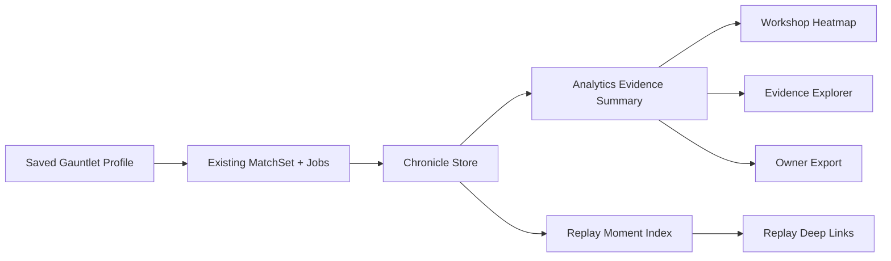

# Architecture Research: v1.6 Workshop Analytics and Evidence Explorer

**Project:** Coward's Game
**Date:** 2026-05-21
**Milestone context:** v1.6 Workshop Analytics and Evidence Explorer

## Integration Shape

v1.6 should add a stable analytics layer between existing MatchSet evidence and Workshop UI.

## New Concepts

### Gauntlet Profile

Persist a named owner-owned profile with an immutable compatibility snapshot. The user can rename or annotate a profile, but rerun compatibility should be based on captured inputs and compatibility versions.

Likely fields:

- `id`, `owner_user_id`, `name`, `description`, `created_at`, `updated_at`.
- `candidate_revision_ids`, `opponent_revision_ids`.
- `opponent_tags` or denormalized public labels at creation time.
- `preset_id`, `seed_policy`, `mirror_sides`, `scoring_policy`.
- `rule_version`, `chronicle_version`, `runtime_adapter`, `runtime_version`.
- `profile_hash` and `compatibility_key`.

### Analytics Summary

Create typed summary DTOs in persistence/spec rather than deriving UI-only structures in React. Summaries should be serializable and public-safe by default.

Likely objects:

- `GauntletSummary`.
- `MatchupRecord`.
- `EvidenceBand`.
- `ReplayReference`.
- `ExportableGauntletSummary`.

### Replay Moment Index

Build representative moment selection from public-projected Chronicle/timeline data. The index should map moments to sequence numbers and public labels while avoiding private payload details.

Moment selection can be deterministic:

- First and/or most decisive Backstab.
- First contraction.
- First Fall.
- Push resolving a large position swing where detectable from public events.
- No-advance cleanup as blocked/no-reverse or inactivity-style public explanation where available.
- Late-cycle stabilization near the final counted phase of the Match.

## Modified Areas

- `packages/persistence/src/workshop.ts`: saved profiles, rerun creation, profile summaries.
- `packages/persistence/src/matchset-status.ts` and `scoring.ts`: evidence counts, failure categories, side splits.
- `apps/web/app/workshop/server.ts`: server methods for profiles, analytics, reruns, exports.
- `apps/web/app/workshop/workshop-client.tsx`: heatmap, explorer, export controls.
- `apps/web/app/matches/replay-ready.ts`: initial sequence/deep-link support and representative moment metadata.
- `packages/spec/src`: schemas/types for analytics DTOs and export DTOs.
- `packages/persistence/migrations`: profile/summary persistence.

## Build Order

1. Define analytics contracts and evidence-band rules before UI.
2. Persist saved profile inputs and compatibility keys.
3. Add rerun/compare service methods that reuse existing MatchSet creation and worker jobs.
4. Build heatmap/explorer projections from summaries.
5. Add replay moment indexing and deep-link handling.
6. Add owner-safe export DTOs and endpoints.
7. Generate demo data and verify privacy/runtime boundaries.

## Testing Implications

- Contract/schema tests for every public/owner analytics DTO.
- Determinism tests for profile hash, compatibility equivalence, matrix expansion, summary ordering, evidence-band classification, and replay moment selection.
- Persistence tests for profile save/rerun/compare/export.
- Privacy leak tests for public analytics, replay references, and exports.
- Runtime isolation tests proving profile/rerun routes enqueue MatchSets/jobs but never execute Strategy code in web/API.
- Playwright/browser checks for Workshop heatmap, explorer drilldown, deep links, and export affordances.

## Sources

- `packages/spec/src/types.ts`
- `packages/spec/src/schemas.ts`
- `packages/persistence/src/workshop.ts`
- `packages/persistence/src/matchset-status.ts`
- `packages/persistence/src/scoring.ts`
- `apps/web/app/workshop/server.ts`
- `apps/web/app/matches/replay-ready.ts`
