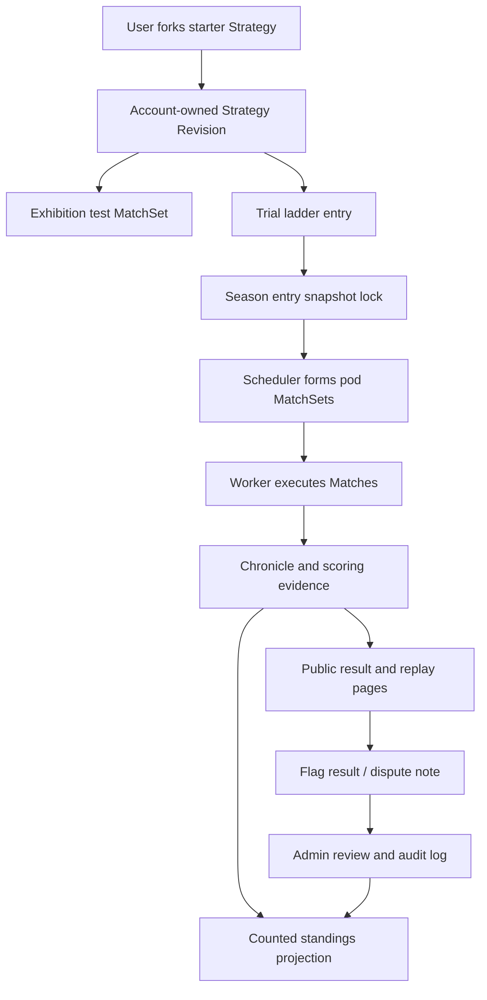

# Architecture Research: v1.3 Competition Trust Beta

**Project:** Coward's Game  
**Date:** 2026-05-19  
**Milestone context:** v1.3 Competition Trust Beta

## Architectural Direction

v1.3 should extend the v1.2 competition architecture rather than create a separate ranked system. The correct spine is:

1. `@cowards/spec` owns season, ladder, public profile, public Strategy card, dispute, moderation, and adapter metadata contracts.
2. `@cowards/persistence` owns migrations, repositories, season entry eligibility, scheduler state, standings aggregation, moderation audit, and starter template storage/seeding.
3. `@cowards/worker` keeps MatchSet execution and retry/degraded classification outside the web/API request path.
4. `@cowards/runtime-js` owns the production adapter spike behind the existing Strategy execution boundary.
5. `apps/web` renders account/workshop/season/profile/result views using server DTOs; it does not infer rules or expose private fields.

## Proposed Data Flow

## New or Modified Components

### `packages/spec`

- Add `CompetitionSeason`, `TrialLadderPreset`, `SeasonEntry`, `SeasonEntryStatus`, `SeasonMatchSet`, `SeasonStanding`, `PublicPlayerProfileDto`, `PublicStrategyCardDto`, `ResultFlagDto`, `ModerationAuditEventDto`, and leak-safe assertion helpers.
- Extend competition statuses to distinguish counted, pending review, invalid, and non-competitive where public standings need it.
- Preserve canonical terminology and keep ladder contracts independent from engine rules.

### `packages/persistence`

- Add v1.3 migration for seasons, entries, standings, scheduler batches, public profiles/cards, starter templates, result flags, and moderation audit.
- Add services:
  - `season-service.ts`: create/open/close seasons, entry rules, replacement/stale behavior.
  - `season-scheduler.ts`: deterministic pod/round-robin MatchSet generation.
  - `standings-service.ts`: counted MatchSet aggregation and invalidation recalculation.
  - `public-profile-service.ts`: player and Strategy public DTOs.
  - `moderation-service.ts`: flags, admin review, invalidation, audit log.
  - `starter-strategy-service.ts`: starter library listing, validation, fork into account-owned Strategy.
- Reuse existing `competition.ts`, `matchset-service.ts`, `matchset-status.ts`, and `scoring.ts` rather than duplicating MatchSet execution.

### `apps/web`

- Add public pages for seasons, player handles, and Strategy cards.
- Extend account/workshop to show Starter Library and fork controls.
- Add ladder entry flow for exactly one active revision per user per season.
- Extend result page with counted/non-counted status, dispute flagging, and public moderation outcome.
- Add admin-only review route. Keep authorization server-side.

### `apps/worker`

- Add scheduled job entry point or service call for periodic pod generation.
- Keep Match execution behavior unchanged; standings should consume MatchSet evidence rather than change engine/worker result semantics.

### `packages/runtime-js`

- Promote the existing subprocess adapter from spike to a selectable production candidate, then wrap it in container controls if selected.
- Add adapter metadata for production readiness, resource controls, unsupported capabilities, and fallback behavior.
- Keep all JSON IPC schema validation and failure taxonomy strict.

## Suggested Build Order

1. Starter Strategy Library and public Strategy metadata contracts, because these give new players credible entry points without depending on ladder scheduling.
2. Season/entry eligibility model, because one active revision per user and stale behavior are trust contracts.
3. Scheduler and standings aggregation, because the ladder loop depends on deterministic pods and counted MatchSet policy.
4. Public profiles/Strategy cards/season pages, because users need visibility once standings exist.
5. Dispute/moderation/invalidation, because standings need governance before beta launch.
6. Runtime production boundary spike, which can proceed in parallel after contracts are stable but must land before calling trial ladder trustworthy.

## Integration Risks

- If starter templates are stored only as code constants, lineage/versioning and public cards become awkward. Prefer explicit template metadata plus source hash.
- If standings are stored as mutable totals without provenance, invalidation will become risky. Prefer recomputable aggregation from counted MatchSets, with optional cached projections.
- If scheduler uses wall-clock order or database row order as a tie-breaker, standings can become non-deterministic. Use explicit season seed, entry snapshot ids, source hashes, and stable ids.
- If admin review uses public DTOs only, it will not have enough context to govern disputes. Use server-only inspection DTOs behind admin authorization while keeping public DTOs leak-safe.
- If container/WASI work changes the Strategy API or runtime output shape, it will ripple through engine/replay. Keep the adapter contract stable.

## Sources

- Local: `.planning/PROJECT.md`
- Local: `.planning/milestones/v1.2-ROADMAP.md`
- Local: `packages/spec/src/competition.ts`
- Local: `packages/persistence/src/competition.ts`
- Local: `packages/persistence/src/scoring.ts`
- Local: `apps/worker/src/runner.ts`
- Local: `packages/runtime-js/src/adapter.ts`
- Docker resource constraints docs: https://docs.docker.com/engine/containers/resource_constraints/
- Node child process docs: https://nodejs.org/api/child_process.html
- Wasmtime interruption docs: https://docs.wasmtime.dev/examples-interrupting-wasm.html
