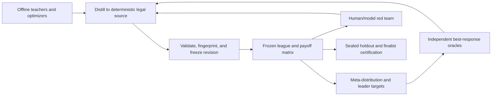

# Competitive Strategy Factory and Adversarial League

## Active D-34L lean admission contract — 2026-09-01

The operator approved `lean_runner_feasibility_v1` as the active ADMIT-03 prerequisite. It freezes one existing Starter/Advanced fixture pair across three canonical arena labels, both sides, and both initiative parities: 12 unique cells executed twice serially, exactly 24 charged Matches, and a 15-minute outer limit. The historical full-matrix result remains immutable `exhausted` at fresh `0/540`, with no reproduction and `reinterpreted:false`. The lean gate is pending, not passed; Plan 262-149 is the sole next action and may create only source and tests. Phase 263 planning/execution and every candidate, formation, holdout, public, product, production, counted-play, gameplay-change, archive, release, and tag authority remain false.

**Status:** Proposed research and implementation handoff
**Prepared:** 2026-07-12
**Rules baseline:** Current canonical `cowards-rules-v1.4` behavior
**Relationship to v2:** Prerequisite evidence for the proposed metagame lab and any later rule comparison; not approval to change rules

## 2026-08-12 Binding Local-Seal Revision

The operator confirmed that no external custody system exists and approved the future `single_operator_local_seal_v1` contract. One named repository operator controls a restricted out-of-repository local holdout store and one closed opening command. This is process separation rather than independent custody and makes no independent/third-party custody, separate-permissioning, non-collusion, comprehensive-host-monitoring, cryptographic-erasure, forensic-deletion, or malicious-owner-resistance claim. Local-seal mechanics and independent verification of their evidence remain pending; ADMIT-03 remains blocked; SEAL-01 remains pending; and candidate search, Phase 263, formation, holdout opening, public exposure, activation, and production authority remain false until the exact two-latch join passes.

The only commitment-secret ingress is `<absolute-local-seal-root>/input/commitment-secret.bin` under the binding owner/type/mode/size/no-follow/read-once/zero-fill/unlink/parent-fsync contract. No secret byte may enter CLI, environment, logs, Git, tests, receipts, artifacts, or output. Historical external-custody records remain immutable evidence and are superseded only for future routing.

## Decision summary

The current Starter and Advanced Strategies are useful smoke tests, teaching examples, and regression fixtures. They are not strong enough, independent enough, or adversarially developed enough to support claims about balance or a long-term metagame.

The next serious Strategy effort should build a **competitive-strategy factory**, not one handcrafted champion:

1. develop legal deterministic controllers against the direct canonical engine;
2. maintain a frozen league and complete payoff matrix;
3. repeatedly generate approximate best responses with independent oracle families;
4. distill offline search or learning into immutable, self-contained Strategy source;
5. red-team the leaders with humans and independently prompted models;
6. produce both a diverse portfolio and a robust pure finalist;
7. certify only finalists through the expensive language/runtime/service path.

This is a multi-oracle PSRO/double-oracle process. Its evidence is **oracle-relative practical exploitability**, not a proof of optimality or a guarantee that the game can never develop a meta.

## Why the existing field is insufficient

The audit found that the ten Advanced Strategies share a generated decision skeleton and that the official Smoke and Open Field arenas are behaviorally identical. The persisted 540-Match matrix is therefore valuable as a regression and throughput fixture, but not as credible balance evidence.

A stronger human or model can plausibly discover qualitatively new planning algorithms, coordination schemes, and exploits. Measuring only variants of a weak shared generator risks mistaking generator limitations for properties of the game.

The valid replacement is an iterative best-response process whose implementations, training methods, and failure modes are genuinely independent.

## Goals

- Generate legal Strategies substantially stronger than the current Advanced library.
- Discover and preserve counters to every provisional leader.
- Exercise the real `selectActivations`/`soldierBrain` information boundary.
- Produce deterministic, compact, runtime-valid Strategy source rather than Match-time model calls.
- Measure robustness across sides, initiative states, arenas, IDs, symmetries, and held-out opponents.
- Give every future rule profile equal adaptation and training compute before comparing it.
- Preserve immutable manifests, sources, payoff matrices, replays, telemetry, and negative results.

## Non-goals

- Proving a Strategy mathematically unbeatable.
- Claiming a frozen deterministic game will remain meta-free forever.
- Treating the PSRO mixed distribution as one deployable deterministic entrant.
- Training through production sandbox, persistence, standings, or web paths.
- Optimizing only against the existing Advanced library.
- Allowing a privileged teacher to leak hidden state into emitted decisions.
- Using invalid output, timeouts, runtime failure, or nondeterminism as tactics.
- Changing production core rules, official arenas, counted policy, or runtime eligibility inside the Strategy milestone. Versioned lab-only starting-formation profiles are permitted after the current-rules league is frozen, but cannot become production, persisted, public, or counted behavior.
- Starting with end-to-end deep reinforcement learning before the tractable structured controller is understood.

## Existing evidence and breadcrumbs

- [Core rules, enforcement, runtime, and metagame audit](v2.0-core-rules-enforcement-runtime-and-metagame-audit.md), especially F-16 through F-22
- [Persisted audit reproductions and current 540-Match matrix](../artifacts/v2.0-core-rules-audit/README.md)
- [Current matrix runner](../artifacts/v2.0-core-rules-audit/run-current-meta-matrix.ts)
- [Proposed v2.0 milestone](../milestone-proposals/v2.0-rules-integrity-and-metagame-renewal/PROPOSAL.md)
- [Proposed v2.0 requirements](../milestone-proposals/v2.0-rules-integrity-and-metagame-renewal/REQUIREMENTS.md), especially META-01 through META-05
- [Proposed v2.0 roadmap](../milestone-proposals/v2.0-rules-integrity-and-metagame-renewal/ROADMAP.md), especially Phases 261, 262, and 265
- [Earlier Advanced Strategy library research](v1.5-STRATEGY-LIBRARY.md)
- [Current shared Advanced Strategy generator](../../packages/persistence/src/advanced-strategies.ts)
- [Canonical Strategy types](../../packages/spec/src/types.ts)
- [Canonical source, memory, objective, and Cycle limits](../../packages/spec/src/constants.ts)
- [Strategy and SoldierBrain input construction](../../packages/engine/src/runtime-inputs.ts)
- [Round/Cycle scheduler](../../packages/engine/src/match.ts)
- [Selection, slot, and local-controller enforcement](../../packages/engine/src/activation.ts)
- [Movement/collision implementation](../../packages/engine/src/movement.ts)
- [Backstab implementation](../../packages/engine/src/backstab.ts)
- [Canonical v1 rules](../../CowardsGameSpec_Full_Consolidated_v1.md)
- [v1.4 Cycle-interleaving amendment](../../CowardsGameSpec_CycleInterleaved_v1.4.md)

The audit machine ran the toy 540-Match direct-engine matrix in about 11.4 seconds. That is evidence that cheap screens are practical, not a promised throughput for search-heavy Strategies. Strong-controller throughput must be measured before locking compute budgets.

## The legal search problem

### Global Round planning

`selectActivations` receives the exact current board, friendly and enemy snapshots, Phase/Round context, activation count, and up to 32KB of StrategyMemory. With eight Soldiers and four ordered selections, there are at most:

`8P4 = 8 × 7 × 6 × 5 = 1,680`

own activation sequences. Enumeration or a narrow beam over ordered Soldier/mission assignments is tractable.

The global planner does **not** currently receive initial initiative explicitly, so it must evaluate both initiative hypotheses or use a robust plan. It can send each selected Soldier a fixed objective of at most 1KB, but that objective may become stale during interleaved play.

### Local tactical planning

`soldierBrain` sees only self state, an anonymous 5×5 Awareness grid, Cycle index, a fixed objective, and up to 2KB of private SoldierMemory. It chooses one of nine Actions. It cannot see global StrategyMemory, other Soldier IDs, other Soldiers' reversal histories, or an authoritative `hasAdvancedThisActivation` flag.

Round 4 can contain up to 96 interleaved local Action opportunities. Primitive full-Match tree search is therefore a poor first design. Search should operate over high-level missions globally and short information-set tactics locally.

### Match-time restrictions

Deployable Strategy source is capped at 64KB and must be synchronous, deterministic, JSON-only, package-free, and self-contained. Network, filesystem, host environment, clocks, nondeterministic randomness, dynamic code, imports, workers, live model inference, and external services are forbidden.

Offline evolution, self-play, search, model-assisted coding, opening-book generation, and teacher training are allowed only when their result is distilled to legal deterministic source such as decision trees, integer scorers, tables, formulas, or explicit control flow.

The written spec and current runtime enforcement disagree on time budgets. Final targets must be fixed only after the integrity milestone establishes one contract. Until then, design for a fixed deterministic node budget and target less than 5ms p99 in direct execution, leaving substantial headroom.

## First competitive controller

The first serious implementation should be a hierarchical adversarial controller rather than another weighted movement profile.

### 1. Canonical tactical state

Normalize the board into a player-forward coordinate frame and derive:

- current and next-Contraction safe bounds;
- occupied, blocked, and impassable cells;
- enemy rear squares and one-Action ingress cells;
- friendly rear-cover relationships;
- head-to-head blocks, side-push lanes, and fatal edge-push destinations;
- legal directed path states including reversal history;
- mobility after one and two Actions;
- snapshot deltas for a compact, uncertainty-aware opponent model.

Opaque player and Soldier IDs must never become strategic entropy. Symmetry and ID-renaming tests must expose accidental dependence.

### 2. Discrete missions

Generate explicit missions instead of independent directional scores:

- `EVACUATE`: reach post-Contraction safety;
- `REAR_ENTRY`: reach a particular enemy rear square;
- `EDGE_PUSH`: construct a side-push or fall sequence;
- `SCREEN`: cover a valuable friendly rear square;
- `ANCHOR`: hold a contraction-safe formation cell;
- `CUT`: create a justified STONE graph cut;
- `RESERVE`: preserve future activation capacity;
- `RECOVER`: guarantee an Advance before slot exhaustion;
- `BAIT` or `PINCER`: create a short adversarial tactical sequence.

Every selected Soldier must have a proof of at least one legal Advance or a deliberate, scored sacrifice rationale. Selecting a boxed Soldier can otherwise cause no-Advance cleanup.

### 3. Ordered assignment and bounded response search

Enumerate or beam-search ordered Soldier/mission assignments under both initiative hypotheses. Evaluate candidate schedules lexicographically:

1. avoid immediate Match loss;
2. force immediate Match win;
3. preserve the next-Contraction ACTIVE count;
4. prevent forced Backstab or fatal push;
5. guarantee required Advances;
6. force enemy STONE/FALLEN outcomes;
7. preserve rear coverage and formation integrity;
8. retain mobility and counterplay;
9. apply a deterministic symmetry-safe tie-break.

Run a small, fixed-node adversarial rollout over plausible opponent missions. Hard survival and legality constraints should not be traded away for several weak positional bonuses.

### 4. Compact objective packet

Within the 1KB limit, encode intent and contingencies rather than a brittle twelve-step script:

```text
{
  planId,
  mission,
  targetCell,
  targetFacing,
  routePrefix,
  safeBounds,
  fallbackCells,
  holdFacing,
  initiativeAssumption
}
```

### 5. Rule-correct local controller

On every Cycle, the SoldierBrain should:

1. infer the previous Action result conservatively;
2. enumerate all nine schema-valid Actions;
3. take a locally certain Match-ending Backstab or fatal push;
4. escape immediate rear-square or fatal edge-push threats;
5. follow the mission while visible facts still support it;
6. hold a defensible facing after a confirmed Advance when further movement is worse;
7. otherwise choose the safest legal empty-cell Advance;
8. use `TURN_TO_STONE` only with a graph-cut or survival justification;
9. retain a cheap deterministic fallback before the node budget is exhausted.

The current API cannot perfectly distinguish self-movement from some push sequences. `hasAdvancedThisActivation` would remove this ambiguity; until then the controller must explicitly document its inference and adversarial edge cases.

## Competitive-strategy factory

The factory should separate offline development from deployable execution:



Each emitted revision should preserve source bytes/hash, rules and engine compatibility, factory version, lineage, doctrine family, oracle family, deterministic build manifest, validation result, runtime profile, behavior fingerprint, and development/evaluation split.

Shared code may cover literal legality, geometry, validation, artifact generation, and reporting. Competing doctrines must not share one selector or one Action-scoring function.

## Independent response oracles

At least three materially independent response families should be implemented, with a human/model red team as a fourth channel.

### Oracle A — Structured tactical controller

Use a deterministic behavior tree or option controller with roughly 150–400 integer parameters. Optimize with CMA-ES first, then use MAP-Elites or grammatical evolution to retain behaviorally distinct niches rather than one converged profile.

### Oracle B — Search teacher and distillation

Use high-level activation beam search plus short information-set MCTS or bounded adversarial search. Aggregate teacher values by canonical legal-input key, then distill to a decision tree, quantized scorer, compact table, or formula. Primitive full-Match MCTS is out of scope.

### Oracle C — Model-guided program search

Give an external model the rules, legal API, decisive replays, and leader source when disclosure is authorized. Ask it to author explicit deterministic best responses. Automatically validate, execute, critique, mutate, and retain only held-out improvements. The model never runs inside a Match.

### Oracle D — Human and external submissions

Treat every credible human or independently developed Strategy as a frozen response oracle and future league target. Preserve failed attacks as evidence rather than reporting only successes.

Useful independent doctrine families include:

- Rearguard Mesh: contraction-safe rear-cover constraint matching;
- Tempo Flank Search: bounded adversarial rear-entry search;
- Edge Conveyor: push-lane flow and edge control;
- Stone Gate: graph-cut sacrifice optimization;
- Adaptive Reserve: snapshot-delta opponent modeling and deterministic doctrine switching;
- Mobility/Escape: reachability and contraction survival without formation assumptions.

## PSRO/double-oracle league loop

1. Freeze the current population, condition manifest, and compute budget.
2. Run the complete mirrored payoff matrix across sides, initiative states, and design arenas.
3. Solve a zero-sum meta-distribution over the frozen population.
4. Train each independent oracle against the distribution and strongest pure policies.
5. Evaluate candidates on untouched validation conditions.
6. Reject clones using source structure and Chronicle-derived behavior distance.
7. Add only legal, novel, positive responses as immutable revisions.
8. Recompute the matrix, best-response graph, and oracle-relative response gap.
9. Repeat for a precommitted number of rounds or compute budget.
10. Freeze finalists before opening the sealed arena/opponent holdout.

Because the current API deploys deterministic source, the useful output is a portfolio of strong pure Strategies plus a separately selected robust pure champion. The PSRO mixture remains training and diagnostic evidence.

## Evaluation integrity

### Information boundary

- Candidate policies receive only serialized legal Strategy inputs.
- Privileged engine state may score counterfactuals offline but may not directly select an emitted Action.
- Identical information-set keys aggregate hidden-state samples rather than create contradictory labels.
- Every decision must reproduce from stored source, input, objective, and memory alone.
- Teacher provenance must disclose any privileged information used offline.

### Frozen conditions

- both player sides and both initial-initiative states;
- horizontally mirrored and ID-renamed equivalents;
- genuinely distinct design arenas;
- sealed holdout arena families and opponents;
- fixed candidate counts, search nodes, model versions/prompts/tokens, human-review procedure, and Match budgets;
- draws worth one-half in Set scoring;
- Match outcomes as the final objective, with tactical telemetry used only for diagnosis.

### Proposed first-program gates

These are starting thresholds to precommit during planning, not current results:

- forced tactic, defense, legality, determinism, and hostile-input suites pass;
- zero runtime violations, system failures, or private-state leaks in accepted evidence;
- emitted source is preferably below 48KB and always below the canonical 64KB cap;
- direct-call p99 is below 5ms under a fixed benchmark profile;
- at least three finalists are structurally and behaviorally distinct;
- two consecutive response iterations exceed 55% Set score against the previous frozen meta-mixture on untouched conditions;
- at least one deployable pure Strategy exceeds 60% against an independent probe field;
- the current Advanced library is beaten above 70% as a regression gate only;
- a fresh targeted red team either fails to exceed 60% against the robust finalist or finds a counter for which the next response iteration improves against the updated mixture;
- no collapse occurs under side, initiative, symmetry, opaque-ID, or held-out-arena tests.

Thresholds must be calibrated and committed before sealed results are inspected. Failure is a useful result and must not cause post-hoc threshold changes.

## Staged implementation program

### Spike 001 — Legal hierarchical planner feasibility

Prove that the full-board mission planner plus local tactical controller fits source, objective, memory, determinism, and runtime constraints and solves a forced tactic/defense suite. This is the highest-risk first step.

### Spike 002 — Structured optimizer and response loop

Build a parallel direct-engine harness, immutable manifests, CMA-ES/MAP-Elites controller optimization, frozen league, complete payoff matrix, and first best-response iterations.

### Spike 003 — Search teacher and deterministic student

Implement a high-level beam/information-set search teacher and distill it to at least two compact deterministic student forms. Compare teacher agreement, student strength, source size, and generalization.

### Spike 004 — Independent human/model red team

Freeze provisional leaders, run independently budgeted model code-authoring attempts and substantive human review, validate all attacks identically, and feed successful counters back into one final response iteration.

### Final certification

Only frozen finalists pay the four-language/runtime-service, replay, persistence, privacy, standings, and end-to-end cost. The offline lab must import the canonical engine rather than copy rules.

A reasonable planning envelope for the first four spikes is roughly 500,000 direct-engine Matches and two to three engineering weeks. This is not a schedule or throughput commitment: measure the first strong controller and revise the deterministic work-unit budget before full execution.

## Equal-compute rule comparison

Fixed-agent comparisons are invalid when a rule change rewards a different planning style. Every serious ruleset candidate must receive equal opportunity to adapt.

Suggested funnel:

1. warm-start each ruleset from the same frozen population where API-compatible;
2. allocate about 50,000 Matches per initial profile for obvious inactivity/degeneracy screening;
3. allocate about 250,000 Matches and at least two response iterations to survivors;
4. allocate 1–3 million Matches plus multiple oracle families to finalists;
5. compare optimized populations and robust pure policies, not transferred toy agents;
6. keep doctrine families, candidate counts, oracle/model/human budgets, search nodes, sides, initiative states, arena corpus, holdout policy, runtime limits, and hardware class equal;
7. certify only the selected ruleset through service, persistence, replay, standings, privacy, and E2E layers.

Report approximate response gap, pure-policy worst-case payoff, support diversity, first contact, Actions before interaction, push/Backstab/block/STONE/Contraction incidence, draws, inactivity, runtime/source complexity, and transfer to held-out arenas and opponents.

## Lab-only starting-formation experiment

After the current-rules league, thresholds, and sealed holdouts are frozen, the milestone should use the same factory to run one contained starting-formation ablation. This is an evaluation deliverable, not authority to ship a rule change.

### Profiles

Compare these profiles while holding the Cycle cap, MOVE rules, Backstab geometry/timing, activation counts, arenas, and every other rule constant:

1. **Current edge rank:** `x=2..9`, top `y=0`, bottom `y=11`.
2. **Inward-rank control:** `x=2..9`, top `y=1`, bottom `y=10`.
3. **Edge-anchored bracket shield:** the primary challenger below.

All Soldiers retain their current inward facing.

```text
Top player facing DOWN

y=0   ..RR....RR..   x={2,3,8,9}
y=1   ....FFFF....   x={4,5,6,7}

y=10  ....FFFF....   x={4,5,6,7}
y=11  ..RR....RR..   x={2,3,8,9}

Bottom player facing UP
```

`R` marks the four boundary wing Soldiers and `F` the four inward center Soldiers.

### Why this challenger exists

- The current edge rank protects all rear squares by placing them off-board, but forces eight Phase-1 evacuation selections.
- The full inward rank removes that evacuation pressure. Its endpoint rear squares are reachable in 12 unobstructed MOVEs under current rules, exactly the current Cycle cap; central rear squares require 13–15.
- The bracket starts all eight Soldiers Backstab-safe without directly stacking rear/front pairs. The wing rears are off-board, while the four empty center rear squares form a sealed pocket bounded by the board edge, the center rank, and the two wing pairs.
- Every Soldier's directly inward square is initially empty, avoiding the self-blocking and front-then-rear deployment script of an aligned 2×4 rectangle.
- Only four Soldiers remain on the first-Contraction boundary, halving compulsory evacuation rather than eliminating it.
- Moving one wing Soldier does not open the center pocket; both wing guards on the same side must vacate. Once open, an attacker starting from the opposing formation still needs at least 15 MOVEs to reach a center rear square under the static-position lower-bound model.
- Protection decays as the formation develops, so the experiment does not make Backstab generally irrelevant.

### Experimental controls

- Freeze and report the current-rules competitive league before creating any alternate start profile.
- Implement starts through one versioned, lab-only initial-state profile boundary; all subsequent transitions must use the canonical engine unchanged.
- Make experimental profiles impossible to register as official arenas/rules, persist as canonical evidence, enter counted scheduling, or appear in public product surfaces.
- Retrain Strategies separately for every profile with equal doctrine, candidate, oracle, model/human, search-node, Match, side, initiative, arena, and replay-review budgets.
- Use the same design/validation/holdout split and open the sealed holdout only after every profile is frozen.
- Do not combine this primary ablation with a lower Cycle cap, attacker-facing Backstab, facing-only MOVE, or scan-timing change. Preserve causality. Record those as separately budgeted future interaction experiments.

### Formation-specific evidence

Measure:

- viable opening selections and opening-policy entropy;
- boundary Soldiers evacuated and unselected ACTIVE reserves at first Contraction;
- first Awareness, contact, push, Backstab, STONE, and decisive event;
- stationary-reserve Backstabs and Backstabs by cause;
- same-direction blocks, blocked/resolved pushes, and no-Advance cleanup;
- center-rush, wing-guard, convoy, reserve-hoarding, and persistent STONE-shield incidence;
- draw rate, Match length, Contractions, ACTIVE survival, response gap, worst-case pure payoff, and best-response graph.

Reject the bracket if independently retrained Strategies converge on a robust scripted opening, convoy/turtle or STONE-shield meta, materially lower interaction, or worse oracle-relative exploitability. A passing result becomes a decision packet for a later rules milestone; it does not ship from this milestone.

## API and contract prerequisites

The integrity/foundation milestone should resolve these before final Strategy certification:

1. add `hasInitiative` to `StrategyInput` so exact activation schedules do not depend on hidden public game state;
2. add `hasAdvancedThisActivation` to `SoldierBrainInput` so self-movement and push displacement are not guessed;
3. reconcile the written 50ms/10ms/100ms budget language with the current approximately 1000ms invocation enforcement;
4. decide explicitly whether compact embedded neural inference is forbidden by “no live model inference”; trees, tables, formulas, and explicit code remain the unambiguous deployment format;
5. remove the Rust/Zig ABI-envelope information advantage or expose the same documented fields to every language;
6. fix entrant-level initiative mirroring before production scheduling is reused as evaluation evidence.

The Strategy lab may spike around known defects but must not silently normalize them or produce authoritative evidence from contaminated runs.

## Persistent outputs

The eventual milestone should preserve:

- factory architecture and one-command reproducible runner;
- immutable experiment and compute-budget manifests;
- training/validation/sealed split identities;
- emitted legal source, hashes, lineage, validation, and runtime reports;
- population checkpoints, payoff matrices, and meta-distributions;
- behavior fingerprints and clone/independence reports;
- information-boundary and deterministic-reproduction audits;
- response-oracle and red-team logs, including failed attacks;
- held-out evaluation opened once at the declared gate;
- accepted/rejected candidate ledger;
- equal-compute ruleset-comparison protocol;
- current/inward/bracket formation manifests, separately retrained populations, causal comparison report, and later-milestone decision packet;
- final report that distinguishes observed evidence from claims the experiment cannot support.

## Research basis

- Lanctot et al., [A Unified Game-Theoretic Approach to Multiagent Reinforcement Learning](https://arxiv.org/abs/1711.00832) — Policy-Space Response Oracles.
- Vinyals et al., [Grandmaster level in StarCraft II using multi-agent reinforcement learning](https://www.nature.com/articles/s41586-019-1724-z) — league training and exploiters as an empirical precedent, not a directly transplantable architecture.
- Lanctot et al., [OpenSpiel: A Framework for Reinforcement Learning in Games](https://arxiv.org/abs/1908.09453) — reproducible game-learning and evaluation tooling.

## Recommended sequencing

1. Ship the non-controversial audit repairs and API/evaluation prerequisites without experimental gameplay changes.
2. Run and freeze the competitive Strategy factory milestone's current-rules league.
3. Use that frozen lab to compare the current, inward-rank, and edge-anchored bracket starts under otherwise identical current rules.
4. Use its league, oracles, holdouts, and equal-compute protocol to evaluate later isolated v2 rule experiments.
5. Promote only the smallest causally supported rule bundle and Strategies retrained for it.
